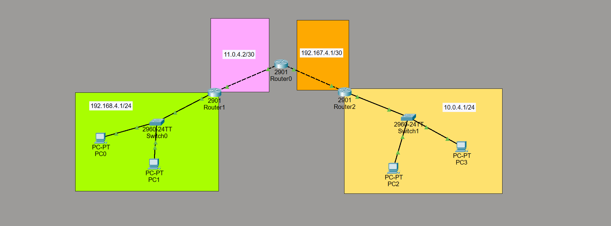
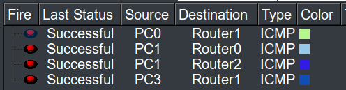

# Manual de Actividad Práctica 5 — Ruteo Estático
**Nombre:** Ebed Isai Patzan Tzic
**Carnet:** 202308204  
**Redes de Computadoras 1**
**Universidad San Carlos de Guatemala — Facultad de Ingeniería**
**Fecha:** 13 de marzo de 2026

---

## 1. Descripción General

Se implementará enrutamiento estático para comunicar dos redes LAN a través de tres routers interconectados. Con **XX = 04** (últimos 2 dígitos del carnet), las redes quedan así:

| Red | Dirección | Máscara | Ubicación |
|---|---|---|---|
| LAN Izquierda | 192.168.**4**.0 | 255.255.255.0 (/24) | Router1 — PC0 y PC1 |
| WAN R1 ↔ R0 | 11.0.**4**.0 | 255.255.255.252 (/30) | Enlace Router1 a Router0 |
| WAN R0 ↔ R2 | 192.167.**4**.0 | 255.255.255.252 (/30) | Enlace Router0 a Router2 |
| LAN Derecha | 10.0.**4**.0 | 255.255.255.0 (/24) | Router2 — PC2 y PC3 |

> **¿Por qué /30?** Una red /30 tiene solo 2 hosts útiles — perfecto para enlaces punto a punto entre routers donde solo se necesitan 2 IPs.

---

## 2. Diagrama de la Topología



---

## 3. Plan de Direccionamiento IP

### 3.1 Interfaces de los Routers

| Dispositivo | Interfaz | Dirección IP | Máscara | Red |
|---|---|---|---|---|
| Router1 | Fa0/0 | 192.168.4.1 | 255.255.255.0 | LAN Izquierda |
| Router1 | Fa0/1 | 11.0.4.1 | 255.255.255.252 | WAN → Router0 |
| Router0 | Fa0/1 | 11.0.4.2 | 255.255.255.252 | WAN → Router1 |
| Router0 | Fa0/0 | 192.167.4.1 | 255.255.255.252 | WAN → Router2 |
| Router2 | Fa0/0 | 192.167.4.2 | 255.255.255.252 | WAN → Router0 |
| Router2 | Fa0/1 | 10.0.4.1 | 255.255.255.0 | LAN Derecha |

### 3.2 Configuración de PCs

| PC | Dirección IP | Máscara | Default Gateway |
|---|---|---|---|
| PC0 | 192.168.4.10 | 255.255.255.0 | 192.168.4.1 |
| PC1 | 192.168.4.11 | 255.255.255.0 | 192.168.4.1 |
| PC2 | 10.0.4.10 | 255.255.255.0 | 10.0.4.1 |
| PC3 | 10.0.4.11 | 255.255.255.0 | 10.0.4.1 |

> Las direcciones 192.168.4.1 y 10.0.4.1 quedan reservadas para el gateway predeterminado de cada LAN, por eso no se asignan a las PCs.
---

## 4. Comandos de Configuración
### 4.1 Router1 (LAN Izquierda — 192.168.4.0/24)

#### Interfaces

```
enable
configure terminal
hostname Router1

! --- Interfaz hacia la LAN izquierda ---
interface gig0/0
ip address 192.168.4.1 255.255.255.0
no shutdown
exit

! --- Interfaz WAN hacia Router0 ---
interface gig0/1
ip address 11.0.4.1 255.255.255.252
no shutdown
exit
```

#### Rutas estáticas

```
! Router1 no conoce la LAN derecha ni la WAN R0-R2.
! Ambas rutas usan como next-hop la IP de Router0 en el enlace: 11.0.4.2

ip route 192.167.4.0 255.255.255.252 11.0.4.2
ip route 10.0.4.0 255.255.255.0 11.0.4.2

end
write memory
```
> **¿Por qué la ruta 192.167.4.0?** Para que el tráfico de *retorno* funcione, Router1 debe saber cómo responder a paquetes que vienen desde el lado de Router2. Sin esta ruta, los paquetes llegan pero la respuesta se pierde.

---

### 4.2 Router0 (Router Intermedio)

#### Interfaces

```
enable
configure terminal
hostname Router0

! --- Interfaz WAN hacia Router1 ---
interface gig0/1
ip address 11.0.4.2 255.255.255.252
no shutdown
exit

! --- Interfaz WAN hacia Router2 ---
interface gig0/0
ip address 192.167.4.1 255.255.255.252
no shutdown
exit
```

#### Rutas estáticas

```
! Router0 está en el centro. Conoce ambos enlaces WAN directamente,
! pero necesita aprender las LANs de cada extremo.

ip route 192.168.4.0 255.255.255.0 11.0.4.1
ip route 10.0.4.0 255.255.255.0 192.167.4.2

end
write memory
```
> **Next-hops:** `11.0.4.1` apunta a Router1 y `192.167.4.2` apunta a Router2.

---

### 4.3 Router2 (LAN Derecha — 10.0.4.0/24)

#### Interfaces

```
enable
configure terminal
hostname Router2

! --- Interfaz WAN hacia Router0 ---
interface gig0/0
ip address 192.167.4.2 255.255.255.252
no shutdown
exit

! --- Interfaz hacia la LAN derecha ---
interface gig0/1
ip address 10.0.4.1 255.255.255.0
no shutdown
exit
```

#### Rutas estáticas

```
! Router2 necesita conocer la LAN izquierda y la WAN R1-R0
! para que el tráfico de regreso funcione correctamente.

ip route 192.168.4.0 255.255.255.0 192.167.4.1
ip route 11.0.4.0 255.255.255.252 192.167.4.1

end
write memory
```
> **¿Por qué la ruta 11.0.4.0?** Misma razón que en Router1 — simetría. Router2 necesita conocer el enlace WAN entre Router1 y Router0 para enrutar correctamente las respuestas.

---

## 5. Tabla Resumen de Rutas Estáticas

| Router | Red Destino | Máscara | Next-Hop | Razón |
|---|---|---|---|---|
| Router1 | 192.167.4.0 | 255.255.255.252 | 11.0.4.2 | WAN R0-R2 (retorno) |
| Router1 | 10.0.4.0 | 255.255.255.0 | 11.0.4.2 | LAN derecha |
| Router0 | 192.168.4.0 | 255.255.255.0 | 11.0.4.1 | LAN izquierda |
| Router0 | 10.0.4.0 | 255.255.255.0 | 192.167.4.2 | LAN derecha |
| Router2 | 192.168.4.0 | 255.255.255.0 | 192.167.4.1 | LAN izquierda |
| Router2 | 11.0.4.0 | 255.255.255.252 | 192.167.4.1 | WAN R1-R0 (retorno) |

---

## 6. Verificación y Pruebas de Conectividad

### 6.1 Ver tabla de ruteo

```
show ip route
```

**Router1**


**Router0**


**Router2**


| Código | Significado |
|---|---|
| `C` | Connected — red directamente conectada |
| `L` | Local — IP de la propia interfaz |
| `S` | Static — ruta estática configurada manualmente |

### 6.2 Ver estado de interfaces

```
show ip interface brief
```

Todas las interfaces deben mostrar `up` en Status y `up` en Protocol.

**Router1**


**Router0**


**Router2**


### 6.3 Pruebas de ping desde las PCs



### 6.4 Traceroute para verificar el camino

```
tracert 10.0.4.10
```


---

## 7. Solución de Problemas Comunes

| Problema | Solución |
|---|---|
| Interfaz en estado `down/down` | Falta el comando `no shutdown`. Verificar con `show ip interface brief`. |
| Ping falla — Request timed out | Verificar que TODOS los routers tengan rutas en AMBAS direcciones. |
| Primer ping falla (80%) | Normal en Packet Tracer por el proceso ARP. El segundo ping debe dar 100%. |
| Error `incomplete` en show ip route | La interfaz del next-hop está caída. Revisar estado de interfaces. |
| IP mal asignada | Usar `no ip address` para borrar, luego asignar la IP correcta. |

---

## 8. Referencia Rápida de Comandos

| Comando | Descripción |
|---|---|
| `enable` | Entrar a modo privilegiado |
| `configure terminal` | Entrar a modo de configuración global |
| `hostname NOMBRE` | Cambiar el nombre del router |
| `interface fa0/0` | Seleccionar una interfaz |
| `ip address IP MASCARA` | Asignar IP y máscara |
| `no shutdown` | Activar la interfaz |
| `exit` | Salir un nivel |
| `end` | Volver al modo EXEC privilegiado |
| `ip route RED MASCARA NEXTHOP` | Agregar ruta estática |
| `show ip route` | Ver tabla de ruteo completa |
| `show ip interface brief` | Ver estado de todas las interfaces |
| `ping IP` | Probar conectividad |
| `tracert IP` | Rastrear la ruta (desde PC) |
| `write memory` | Guardar la configuración |
| `show running-config` | Ver la configuración activa |

---

*Carnet: 202308204 — Actividad Práctica 5 — Redes de Computadoras 1 — USAC — Marzo 2026*