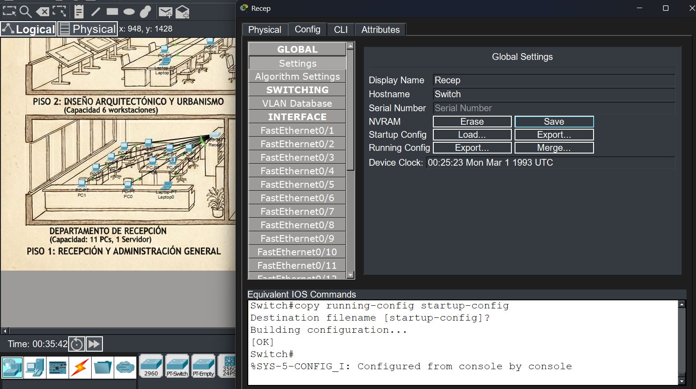
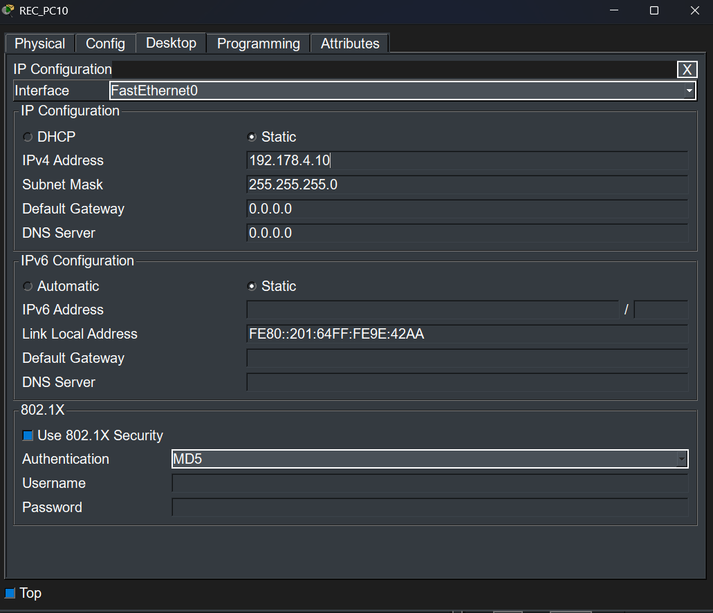
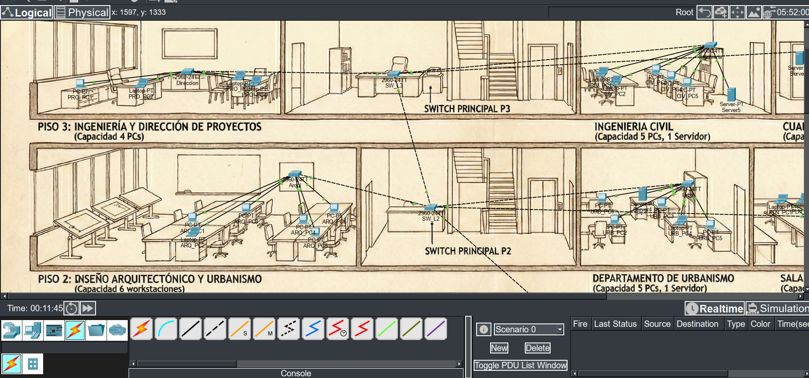
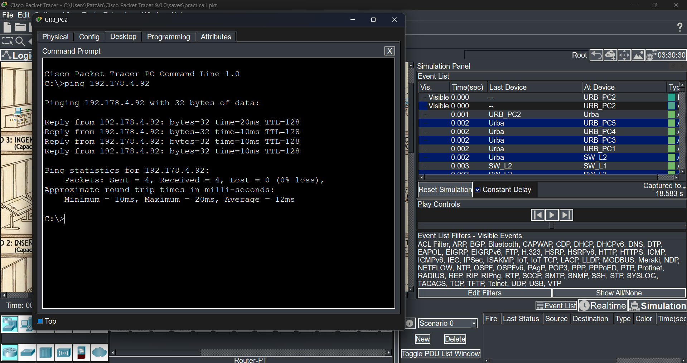

# Manual Técnico: Diseño e Implementación de Red LAN para Constructiva S.A.

## 1. Introducción

Este manual detalla el proceso de diseño, implementación y verificación de la infraestructura de red para la empresa "Constructiva S.A.". El objetivo principal es establecer una red de área local (LAN) funcional, organizada y segura en su nuevo edificio corporativo de tres niveles, utilizando el simulador Cisco Packet Tracer.

La red ha sido diseñada para garantizar la interconexión total entre todos los departamentos, permitiendo una comunicación eficiente y centralizada, siguiendo los requerimientos especificados en el documento de la práctica.

## 2. Topología de la Red

Se ha implementado una topología de red jerárquica de dos capas (Acceso y Distribución). Esta topología es ideal para la infraestructura de un edificio de varios pisos, ya que es escalable, fácil de administrar y permite un buen rendimiento.

*   **Capa de Distribución**: En cada uno de los tres pisos, se ha instalado un switch principal (`SW_L1`, `SW_L2`, `SW_L3`). Estos switches actúan como un punto central de distribución para todo el tráfico del piso, conectando los switches de la capa de acceso.
*   **Capa de Acceso**: Cada departamento cuenta con su propio switch. Este switch proporciona conectividad directa a los dispositivos finales (computadoras y servidores) de esa área.

Esta estructura segmenta la red por departamentos y pisos, lo que aísla el tráfico y facilita la solución de problemas. La conexión entre los switches principales de cada piso y entre los switches de distribución y acceso se realiza con cables cruzados (crossover), como es estándar para conectar dispositivos iguales.

A continuación, se muestra el diagrama general de la topología de red implementada:

**Diagrama General**


## 3. Direccionamiento IP

La red opera sobre la dirección base **`192.178.4.0/24`**, con una máscara de subred de **`255.255.255.0`**. Se ha asignado una dirección IP estática única a cada dispositivo final (PCs y servidores) para asegurar que no haya conflictos y facilitar la identificación de cada equipo en la red.

La siguiente tabla detalla la asignación de direcciones IP para cada dispositivo en cada departamento:

# Tabla de Direcciones IP - Constructiva S.A.
Red: 192.178.4.0/24
Máscara: 255.255.255.0

## 🏢 Piso 1

### 🔹 Recepción (11 PCs)
| Dispositivo | IP |
|-------------|------|
| REC_PC1 | 192.178.4.1 |
| REC_PC2 | 192.178.4.2 |
| REC_PC3 | 192.178.4.3 |
| REC_PC4 | 192.178.4.4 |
| REC_PC5 | 192.178.4.5 |
| REC_PC6 | 192.178.4.6 |
| REC_PC7 | 192.178.4.7 |
| REC_PC8 | 192.178.4.8 |
| REC_PC9 | 192.178.4.9 |
| REC_PC10 | 192.178.4.10 |
| REC_PC11 | 192.178.4.11 |

### 🔹 Contabilidad (8 PCs)
| Dispositivo | IP |
|-------------|------|
| CONT_PC1 | 192.178.4.20 |
| CONT_PC2 | 192.178.4.21 |
| CONT_PC3 | 192.178.4.22 |
| CONT_PC4 | 192.178.4.23 |
| CONT_PC5 | 192.178.4.24 |
| CONT_PC6 | 192.178.4.25 |
| CONT_PC7 | 192.178.4.26 |
| CONT_PC8 | 192.178.4.27 |

### 🔹 Legal (5 PCs)
| Dispositivo | IP |
|-------------|------|
| LEGAL_PC1 | 192.178.4.31 |
| LEGAL_PC2 | 192.178.4.32 |
| LEGAL_PC3 | 192.178.4.33 |
| LEGAL_PC4 | 192.178.4.34 |
| LEGAL_PC5 | 192.178.4.35 |

### 🔹 Sala de Reuniones (5 PCs)
| Dispositivo | IP |
|-------------|------|
| REUN_PC1 | 192.178.4.41 |
| REUN_PC2 | 192.178.4.42 |
| REUN_PC3 | 192.178.4.43 |
| REUN_PC4 | 192.178.4.44 |
| REUN_PC5 | 192.178.4.45 |

---

## 🏢 Piso 2

### 🔹 Arquitectura (6 PCs)
| Dispositivo | IP |
|-------------|------|
| ARQ_PC1 | 192.178.4.51 |
| ARQ_PC2 | 192.178.4.52 |
| ARQ_PC3 | 192.178.4.53 |
| ARQ_PC4 | 192.178.4.54 |
| ARQ_PC5 | 192.178.4.55 |
| ARQ_PC6 | 192.178.4.56 |

### 🔹 Urbanismo (5 PCs + 1 servidor)
| Dispositivo | IP |
|-------------|------|
| URBA_PC1 | 192.178.4.61 |
| URBA_PC2 | 192.178.4.62 |
| URBA_PC3 | 192.178.4.63 |
| URBA_PC4 | 192.178.4.64 |
| URBA_PC5 | 192.178.4.65 |
| URBA_SERVER | 192.178.4.66 |

### 🔹 Sala de Planos (5 PCs)
| Dispositivo | IP |
|-------------|------|
| PLANOS_PC1 | 192.178.4.71 |
| PLANOS_PC2 | 192.178.4.72 |
| PLANOS_PC3 | 192.178.4.73 |
| PLANOS_PC4 | 192.178.4.74 |
| PLANOS_PC5 | 192.178.4.75 |

---

## 🏢 Piso 3

### 🔹 Dirección General (4 PCs)
| Dispositivo | IP |
|-------------|------|
| DIR_PC1 | 192.178.4.81 |
| DIR_PC2 | 192.178.4.82 |
| DIR_PC3 | 192.178.4.83 |
| DIR_PC4 | 192.178.4.84 |

### 🔹 Ingeniería Civil (5 PCs + 1 servidor)
| Dispositivo | IP |
|-------------|------|
| ING_PC1 | 192.178.4.91 |
| ING_PC2 | 192.178.4.92 |
| ING_PC3 | 192.178.4.93 |
| ING_PC4 | 192.178.4.94 |
| ING_PC5 | 192.178.4.95 |

## 4. Configuración de Dispositivos

### Configuración de Switches (CLI)

Todos los switches de la red (modelo Cisco 2960) fueron configurados a través de la Interfaz de Línea de Comandos (CLI). Las configuraciones básicas aplicadas a cada uno incluyen:

1.  **Hostname**: Se asignó un nombre único a cada switch para identificar su ubicación y función (ej. `SW_L1`, `Recep`, `Conta`).
2.  **Contraseña de Acceso**: Se estableció una contraseña de acceso a la consola para asegurar los dispositivos.

**Comandos de Ejemplo (Aplicados a un switch):**

```bash
# Ingresar al modo de configuración global
enable
configure terminal

# 1. Asignar un hostname
hostname Recep

# 2. Configurar contraseña de acceso
line console 0
password 202308204
login
exit

# 3. Guardar la configuración
end
copy running-config startup-config
```

**Evidencia de Configuración:**

A continuación se muestra una captura de la configuración del hostname en uno de los switches.


### Configuración de Equipos Finales

A cada PC y servidor se le asignó una dirección IP estática, la máscara de subred y la puerta de enlace predeterminada (aunque en esta topología de Capa 2 no se requiere un gateway, se mantiene el campo).

**Evidencia de Configuración:**



## 5. Cableado Estructurado (Estándar TIA/EIA-568B)

Se utilizó el estándar TIA/EIA-568B para todo el cableado de la red, asegurando la compatibilidad y el rendimiento.
*   **Cable de Cobre Directo (Straight-Through)**: Utilizado para conectar dispositivos de diferente capa, como PCs y servidores a los switches de acceso.
*   **Cable de Cobre Cruzado (Crossover)**: Utilizado para conectar dispositivos de la misma capa, como los switches de acceso a los switches de distribución y los switches de distribución entre sí.



## 6. Pruebas de Conectividad (Ping)

Para verificar la conectividad total en la red, se realizaron pruebas de `ping` (ICMP) entre diferentes puntos de la red. Estas pruebas confirmaron que todos los dispositivos pueden comunicarse entre sí, sin importar su ubicación física o departamento.

**Resultados de las Pruebas:**

1.  **Ping entre PCs del mismo departamento (Piso 1):**
    

2.  **Ping entre una PC del Piso 3 y una del Piso 1:**
    

3.  **Ping entre una PC del Piso 3 y una del Piso 2:**
    

Todas las pruebas de ping fueron exitosas, lo que demuestra que la red está completamente operativa.

## 7. Análisis de Paquetes (ARP e ICMP)

Para entender cómo los dispositivos se comunican en la red, se utilizó el modo de simulación de Packet Tracer para analizar los protocolos **ARP (Address Resolution Protocol)** e **ICMP (Internet Control Message Protocol)**.

*   **ARP**: Cuando una PC necesita enviar un paquete a otra por primera vez, no conoce la dirección física (MAC) de destino. ARP se encarga de resolver esto. El dispositivo de origen envía una solicitud ARP (ARP Request) a toda la red (broadcast) preguntando "¿Quién tiene la IP `192.178.4.X`?". El dispositivo con esa IP responde con su dirección MAC (ARP Reply). Una vez que se conoce la dirección MAC, se puede enviar el paquete.
*   **ICMP**: Este es el protocolo utilizado por el comando `ping`. Una vez que ARP ha resuelto la dirección MAC, el dispositivo de origen envía un paquete ICMP Echo Request al destino. Si el destino es alcanzable, responde con un ICMP Echo Reply, confirmando la conectividad.

**Evidencia del Proceso de Simulación:**

La siguiente captura muestra el momento en que se inicia un `ping`. Se puede observar que el primer paquete que se genera es de tipo ARP, para descubrir la dirección MAC, seguido por los paquetes ICMP del ping.



Este análisis confirma que la comunicación en la capa de enlace de datos (ARP) y la capa de red (ICMP) funciona como se esperaba.

## 8. Conclusión

La red LAN para "Constructiva S.A." se ha implementado con éxito. Se ha seguido una topología jerárquica robusta, un plan de direccionamiento IP ordenado y se han configurado todos los dispositivos de acuerdo con las especificaciones. Las pruebas de conectividad y el análisis de paquetes demuestran que la red es totalmente funcional y cumple con todos los requisitos del proyecto.
