# 📘 MANUAL TÉCNICO — Proyecto 2: BanTech GT
**Infraestructura Financiera y Alta Disponibilidad**

---

**Universidad San Carlos de Guatemala**
**Facultad de Ingeniería — Ingeniería en Ciencias y Sistemas**
**Curso:** Redes de Computadoras 1
**Carnet:** 202308204
**Nombre del estudiante:** _[Tu nombre completo aquí]_
**Fecha de entrega:** 29 de abril de 2026

---

## Tabla de Contenidos

1. [Introducción](#1-introducción)
2. [Datos de Identificación](#2-datos-de-identificación)
3. [Tabla de VLANs](#3-tabla-de-vlans)
4. [Tablas de Subnetting](#4-tablas-de-subnetting)
5. [Arquitectura del Backbone Core](#5-arquitectura-del-backbone-core)
6. [Sede Occidente — Agencia Regional Comercial](#6-sede-occidente--agencia-regional-comercial)
7. [Sede Norte — Centro de Autorización de Créditos](#7-sede-norte--centro-de-autorización-de-créditos)
8. [Sede Oriente — Centro Financiero Legado](#8-sede-oriente--centro-financiero-legado)
9. [Data Center y Sede Central — Alta Seguridad](#9-data-center-y-sede-central--alta-seguridad)
10. [Configuraciones Clave de Dispositivos](#10-configuraciones-clave-de-dispositivos)
11. [Pruebas de Conectividad y Alta Disponibilidad](#11-pruebas-de-conectividad-y-alta-disponibilidad)
12. [Conclusiones](#12-conclusiones)

---

## 1. Introducción

Este documento constituye el Manual Técnico oficial del Proyecto 2 de Redes de Computadoras 1, titulado "Infraestructura Financiera y Alta Disponibilidad — BanTech GT". El proyecto consiste en el diseño, implementación y documentación de una red corporativa de misión crítica para la entidad financiera ficticia "BanTech GT", simulada en Cisco Packet Tracer.

La infraestructura diseñada responde a los requerimientos de negocio de una institución bancaria que exige continuidad operativa 24/7, segmentación segura del tráfico transaccional, redundancia en todos los niveles críticos y convergencia entre múltiples dominios de enrutamiento.

El diseño cubre cuatro sedes regionales: **Occidente** (Agencia Regional Comercial), **Norte** (Centro de Autorización de Créditos), **Oriente** (Centro Financiero Legado) y **Data Center/Central** (Alta Seguridad); todas interconectadas a través de un **Backbone Nacional** conformado por:
- **Multilayer Switches 3650-24PS con IP Routing habilitado** (Core1, Core2) para OSPF + EIGRP/RIPv2 (redistribución)
- **Router de capa 3** (Core3) para OSPF + enlace Serial WAN

---

## 2. Datos de Identificación

| Parámetro | Valor |
|-----------|-------|
| Carnet | 202308204 |
| **XX** (dos últimos dígitos) | **04** |
| **Y** (último dígito) | **4** |
| Dominio VTP | `bantech04` |
| Password VTP | `cisco` |
| Herramienta de simulación | Cisco Packet Tracer 8.x |
| **Dispositivos Backbone** | **Core1:** Multilayer Switch 3650-24PS (IP Routing) | **Core2:** Multilayer Switch 3650-24PS (IP Routing) | **Core3:** Router 4331/2911 |
| Protocolos de enrutamiento | OSPF Area 0, EIGRP AS 100, RIPv2, Rutas Estáticas |
| Protocolos de redundancia | HSRP, Rapid PVST+, EtherChannel LACP |

---

## 3. Tabla de VLANs

### 3.1 Sede Occidente

| ID VLAN | Nombre | Área Funcional | Hosts Requeridos | Red Asignada |
|---------|--------|----------------|------------------|--------------|
| **14** | Cajas | Transacciones críticas | 45 | 192.168.10.0/26 |
| **24** | Asesores | Servicio al cliente | 30 | 192.168.10.64/27 |
| **34** | Gerencia | Administración local | 10 | 192.168.10.112/28 |
| **44** | Seguridad | Cámaras y Biométricos | 12 | 192.168.10.96/28 |

### 3.2 Sede Norte

| ID VLAN | Nombre | Área Funcional | Hosts Requeridos | Red Asignada |
|---------|--------|----------------|------------------|--------------|
| **54** | Analisis | Analistas de Riesgo | 50 | 192.168.20.0/26 |
| **64** | Auditoria | Revisión de cuentas | 25 | 192.168.20.64/27 |
| **74** | Legal | Contratos | 14 | 192.168.20.96/28 |

### 3.3 Sede Oriente

| ID VLAN | Nombre | Área Funcional | Hosts Requeridos | Red Asignada |
|---------|--------|----------------|------------------|--------------|
| **84** | Boveda | Operaciones de valores | 40 | 192.168.30.64/26 |
| **94** | Plataforma | Atención VIP | 60 | 192.168.30.0/26 |

### 3.4 Data Center y Sede Central

| ID VLAN | Nombre | Área Funcional | Hosts Requeridos | Red Asignada |
|---------|--------|----------------|------------------|--------------|
| **14** | Core_BD | Servidores de Base de Datos | 14 | 192.168.40.32/28 |
| **24** | Web_Apps | Servidores de Banca Virtual | 28 | 192.168.40.0/27 |
| **34** | NOC | Monitoreo central | 10 | 192.168.40.48/28 |

> **Nota:** Los IDs de VLAN 14, 24, 34 se repiten entre Occidente y Data Center porque la fórmula es la misma (1Y, 2Y, 3Y con Y=4). Son segmentos completamente separados e independientes.

---

## 4. Tablas de Subnetting

### 4.1 Backbone Core — FLSM /30 (Bloque: 10.10.0.0/24)

| Enlace | Red | Máscara | IP Core1(SW) / Core3 | IP Core2(SW) / R-Xx | Broadcast |
|--------|-----|---------|----------------------|---------------------|-----------|
| Core1 (SW) ↔ Core2 (SW) (EtherChannel/fibra) | 10.10.0.0 | /30 | 10.10.0.1 (GigE1/1/1-2 PC1) | 10.10.0.2 (GigE1/1/1-2 PC1) | 10.10.0.3 |
| Core1 (SW) ↔ Core3 (Router) (GigE1/1/3-GigE0/0) | 10.10.0.4 | /30 | 10.10.0.5 (GigE1/1/3) | 10.10.0.6 (GigE0/0) | 10.10.0.7 |
| Core2 (SW) ↔ Core3 (Router) (GigE1/1/3-GigE0/1) | 10.10.0.8 | /30 | 10.10.0.9 (GigE1/1/3) | 10.10.0.10 (GigE0/1) | 10.10.0.11 |
| Core1 (SW) ↔ R-Occidente (GigE1/1/4-GigE0/0) (EIGRP) | 10.10.0.12 | /30 | 10.10.0.13 (GigE1/1/4) | 10.10.0.14 (GigE0/0) | 10.10.0.15 |
| Core2 (SW) ↔ R-Norte (GigE1/1/4-GigE0/0) (RIPv2) | 10.10.0.16 | /30 | 10.10.0.17 (GigE1/1/4) | 10.10.0.18 (GigE0/0) | 10.10.0.19 |
| Core3 (Router) ↔ MS1-Oriente (GigE0/2-GigE0/1) (OSPF) | 10.10.0.20 | /30 | 10.10.0.21 (GigE0/2) | 10.10.0.22 (GigE0/1) | 10.10.0.23 |
| Core3 (Router) ↔ MS2-Oriente (GigE0/3-GigE0/1) (OSPF) | 10.10.0.24 | /30 | 10.10.0.25 (GigE0/3) | 10.10.0.26 (GigE0/1) | 10.10.0.27 |
| Core1 (SW) ↔ R-Central1 (GigE1/1/5-GigE0/0) (estáticas) | 10.10.0.28 | /30 | 10.10.0.29 (GigE1/1/5) | 10.10.0.30 (GigE0/0) | 10.10.0.31 |
| Core2 (SW) ↔ R-Central2 (GigE1/1/5-GigE0/0) (estáticas) | 10.10.0.32 | /30 | 10.10.0.33 (GigE1/1/5) | 10.10.0.34 (GigE0/0) | 10.10.0.35 |
| Core3 (Router) ↔ Serial WAN (GigE0/4-Serial0/0/0) | 10.10.0.36 | /30 | 10.10.0.37 (Serial0/0/0) | 10.10.0.38 | 10.10.0.39 |

---

### 4.2 Sede Occidente — VLSM (Bloque: 192.168.10.0/24)

**Método:** Se asigna primero a la red con más hosts, usando la potencia de 2 inmediata superior.

| VLAN | Nombre | Hosts req. | Hosts útiles | Red | Máscara | Rango útil | Broadcast | Gateway |
|------|--------|-----------|-------------|-----|---------|------------|-----------|---------|
| 14 | Cajas | 45 | 62 | 192.168.10.0 | /26 (255.255.255.192) | .1 — .62 | .63 | **192.168.10.1** |
| 24 | Asesores | 30 | 30 | 192.168.10.64 | /27 (255.255.255.224) | .65 — .94 | .95 | **192.168.10.65** |
| 44 | Seguridad | 12 | 14 | 192.168.10.96 | /28 (255.255.255.240) | .97 — .110 | .111 | **192.168.10.97** |
| 34 | Gerencia | 10 | 14 | 192.168.10.112 | /28 (255.255.255.240) | .113 — .126 | .127 | **192.168.10.113** |

**Rango libre:** 192.168.10.128 — 192.168.10.255 (disponible para expansión futura)

---

### 4.3 Sede Norte — VLSM (Bloque: 192.168.20.0/24)

| VLAN | Nombre | Hosts req. | Hosts útiles | Red | Máscara | Rango útil | Broadcast | Gateway |
|------|--------|-----------|-------------|-----|---------|------------|-----------|---------|
| 54 | Analisis | 50 | 62 | 192.168.20.0 | /26 (255.255.255.192) | .1 — .62 | .63 | **192.168.20.1** |
| 64 | Auditoria | 25 | 30 | 192.168.20.64 | /27 (255.255.255.224) | .65 — .94 | .95 | **192.168.20.65** |
| 74 | Legal | 14 | 14 | 192.168.20.96 | /28 (255.255.255.240) | .97 — .110 | .111 | **192.168.20.97** |

---

### 4.4 Sede Oriente — VLSM (Bloque: 192.168.30.0/24)

| VLAN | Nombre | Hosts req. | Hosts útiles | Red | Máscara | Rango útil | Broadcast | Gateway HSRP |
|------|--------|-----------|-------------|-----|---------|------------|-----------|--------------|
| 94 | Plataforma | 60 | 62 | 192.168.30.0 | /26 (255.255.255.192) | .1 — .62 | .63 | **192.168.30.1** |
| 84 | Boveda | 40 | 62 | 192.168.30.64 | /26 (255.255.255.192) | .65 — .126 | .127 | **192.168.30.65** |

**IPs físicas para HSRP:**
- MS1 VLAN 94: 192.168.30.2 | MS2 VLAN 94: 192.168.30.3
- MS1 VLAN 84: 192.168.30.66 | MS2 VLAN 84: 192.168.30.67

---

### 4.5 Data Center — VLSM (Bloque: 192.168.40.0/24)

| VLAN | Nombre | Hosts req. | Hosts útiles | Red | Máscara | Rango útil | Broadcast | Gateway |
|------|--------|-----------|-------------|-----|---------|------------|-----------|---------|
| 24 | Web_Apps | 28 | 30 | 192.168.40.0 | /27 (255.255.255.224) | .1 — .30 | .31 | **192.168.40.1** |
| 14 | Core_BD | 14 | 14 | 192.168.40.32 | /28 (255.255.255.240) | .33 — .46 | .47 | **192.168.40.33** |
| 34 | NOC | 10 | 14 | 192.168.40.48 | /28 (255.255.255.240) | .49 — .62 | .63 | **192.168.40.49** |

---

## 4.6 Tabla de Dispositivos Finales por Área

### Sede Occidente — Agencia Regional Comercial

| VLAN | Área Funcional | Cantidad Hosts | Rango de IPs | Gateway | Descripción |
|------|----------------|----------------|--------------|---------|-------------|
| 14 | Cajas | 7 | 192.168.10.1 — 192.168.10.7 | 192.168.10.1 | Transacciones críticas |
| 24 | Asesores | 7 | 192.168.10.65 — 192.168.10.71 | 192.168.10.65 | Servicio al cliente |
| 34 | Gerencia | 5 | 192.168.10.113 — 192.168.10.117 | 192.168.10.113 | Administración local |
| 44 | Seguridad | 7 | 192.168.10.97 — 192.168.10.103 | 192.168.10.97 | Cámaras y Biométricos |
| **Total Occidente** | — | **26 hosts** | — | — | — |

### Sede Norte — Centro de Autorización de Créditos

| VLAN | Área Funcional | Cantidad Hosts | Rango de IPs | Gateway | Descripción |
|------|----------------|----------------|--------------|---------|-------------|
| 54 | Análisis | 7 | 192.168.20.1 — 192.168.20.7 | 192.168.20.1 | Analistas de Riesgo |
| 64 | Auditoría | 7 | 192.168.20.65 — 192.168.20.71 | 192.168.20.65 | Revisión de cuentas |
| 74 | Legal | 5 | 192.168.20.97 — 192.168.20.101 | 192.168.20.97 | Contratos |
| **Total Norte** | — | **19 hosts** | — | — | — |

### Sede Oriente — Centro Financiero Legado

| VLAN | Área Funcional | Cantidad Hosts | Rango de IPs | Gateway HSRP | Descripción |
|------|----------------|----------------|--------------|--------------|-------------|
| 94 | Plataforma | 7 | 192.168.30.1 — 192.168.30.7 | 192.168.30.1 | Atención VIP (con redundancia) |
| 84 | Bóveda | 7 | 192.168.30.65 — 192.168.30.71 | 192.168.30.65 | Operaciones de valores (con redundancia) |
| **Total Oriente** | — | **14 hosts** | — | — | — |

### Data Center y Sede Central — Alta Seguridad

| VLAN | Área Funcional | Cantidad Hosts | Rango de IPs | Gateway | Descripción |
|------|----------------|----------------|--------------|---------|-------------|
| 24 | Web_Apps | 7 | 192.168.40.1 — 192.168.40.7 | 192.168.40.1 | Servidores de Banca Virtual |
| 14 | Core_BD | 7 | 192.168.40.33 — 192.168.40.39 | 192.168.40.33 | Servidores de Base de Datos |
| 34 | NOC | 5 | 192.168.40.49 — 192.168.40.53 | 192.168.40.49 | Monitoreo central |
| **Total Data Center** | — | **19 hosts** | — | — | — |

### Resumen Global de Dispositivos Finales

| Sede | Cantidad Hosts | VLAN Asignadas | Gateway Type |
|------|---|---|---|
| Occidente | 26 | 14, 24, 34, 44 | Estático Router-on-a-Stick |
| Norte | 19 | 54, 64, 74 | Estático Router-on-a-Stick |
| Oriente | 14 | 94, 84 | HSRP (Redundancia) |
| Data Center | 19 | 24, 14, 34 | Estático |
| **TOTAL BANTECH GT** | **78 hosts** | **14 VLANs** | **Múltiple** |

> **Nota:** Mínimo 5-7 hosts representativos por VLAN/área. En Oriente (Sede Oriente), los hosts utilizan el gateway **virtual HSRP** (192.168.30.1 para VLAN 94 y 192.168.30.65 para VLAN 84) que apunta a MS1 (Activo) o MS2 (Standby). En caso de fallo de MS1, el tráfico es redirigido automáticamente a MS2.

---

## 5. Arquitectura del Backbone Core

### 5.1 Descripción General

El Backbone Nacional de BanTech GT representa el núcleo transaccional que interconecta las cuatro sedes del corporativo. Está conformado por **dos Multilayer Switches 3650-24PS** (Core1, Core2) con IP Routing habilitado y **un Router de capa 3** (Core3) que conforman un núcleo redundante con múltiples rutas entre sí, garantizando tolerancia a fallos en el nivel más crítico de la red.
**Configuración de dispositivos:**
- **Core1 (Switch):** IP Routing habilitado | Puertos: GigE1/1/1-2 (EtherChannel fibra), GigE1/1/3 (Core3), GigE1/1/4 (R-Occidente), GigE1/1/5 (R-Central1)
- **Core2 (Switch):** IP Routing habilitado | Puertos: GigE1/1/1-2 (EtherChannel fibra), GigE1/1/3 (Core3), GigE1/1/4 (R-Norte), GigE1/1/5 (R-Central2)
- **Core3 (Router):** Puertos: GigE0/0 (Core1), GigE0/1 (Core2), GigE0/2 (MS1), GigE0/3 (MS2), Serial0/0/0 (WAN)
### 5.2 Topología del Backbone

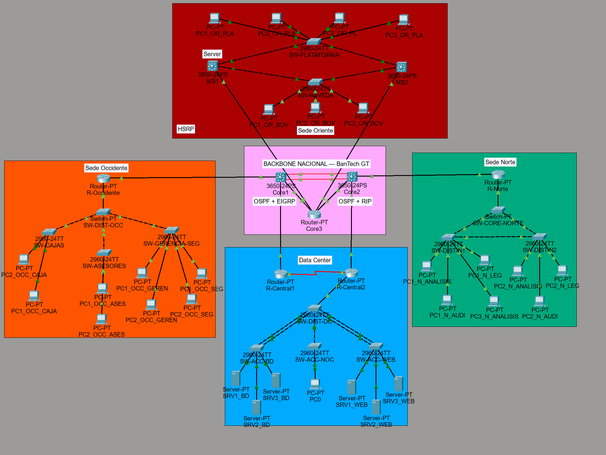


### 5.3 Dominios de Enrutamiento

| Dominio | Protocolo | Dispositivos | Sede asociada |
|---------|-----------|---------|---------------|
| Núcleo principal | **OSPF Area 0** | Core1 (SW), Core2 (SW), Core3, MS1, MS2 | Backbone + Oriente |
| Expansión regional | **EIGRP AS 100** | Core1 (SW), R-Occidente | Sede Occidente |
| Red legada | **RIPv2** | Core2 (SW), R-Norte | Sede Norte |
| Alta seguridad | **Rutas estáticas** | R-Central1, R-Central2, Core1 (SW), Core2 (SW) | Data Center |

### 5.4 Puntos de Redistribución

| Punto | Dispositivo | Tipo | Redistribuye | Justificación |
|-------|------------|------|-------------|----------------|
| **Punto 1** | Core1 | Switch Multicapa | OSPF ↔ EIGRP (bidireccional) | IP Routing habilitado, nexo entre OSPF del backbone y EIGRP de Occidente |
| **Punto 2** | Core2 | Switch Multicapa | OSPF ↔ RIPv2 (bidireccional) | IP Routing habilitado, frontera entre OSPF del backbone y RIPv2 de Norte |
| **Punto 3** | R-Central1 | Router | Estáticas → OSPF | Anuncia Data Center al backbone de forma controlada |

### 5.5 Medios Físicos del Backbone

| Enlace | Medio | Puertos Core1/Core2/Core3 | Velocidad simulada |
|--------|-------|-----------------------|-----------|
| **Core1 (SW) ↔ Core2 (SW)** | **Fibra óptica** (EtherChannel LACP, Port-channel1) | GigE1/1/1, GigE1/1/2 (ambos) | Doble ancho de banda |
| Core1 (SW) ↔ Core3 (Router) | Ethernet Gigabit | GigE1/1/3 ↔ GigE0/0 | 1 Gbps |
| Core2 (SW) ↔ Core3 (Router) | Ethernet Gigabit (redundancia) | GigE1/1/3 ↔ GigE0/1 | 1 Gbps |
| Core3 (Router) ↔ Serial WAN | Enlace Serial (WIC-2T) | Serial0/0/0 | 64 Kbps (simulación WAN) |
| Backbone ↔ Sedes | Ethernet Gigabit | GigE1/1/4-5 (Core1/2) ↔ GigE0/x | 1 Gbps |
---

## 6. Sede Occidente — Agencia Regional Comercial

### 6.1 Justificación de Arquitectura

Se implementó una **topología en estrella jerárquica** con un switch de distribución central (SW-DIST-OCC) y switches de acceso dedicados por área funcional. Esta decisión responde directamente al contexto operativo de la sede: la agencia con mayor volumen de transacciones físicas de la región requiere que un incidente en un área (como un broadcast storm en el área de asesores) no pueda propagarse hacia las cajas transaccionales.

La segmentación mediante VLANs garantiza el aislamiento del tráfico por área. El switch de distribución actúa como concentrador central donde convergen todos los trunks 802.1Q, y el router R-Occidente implementa la técnica **Router-on-a-Stick** mediante subinterfaces, permitiendo el enrutamiento inter-VLAN sin necesidad de un switch multicapa.

#### 6.1.1 Distribución de Switches por Criticidad y Volumen

La decisión de asignar **switches dedicados a Cajas y Asesores**, pero **compartir un switch para Gerencia y Seguridad** obedece a dos factores clave:

| Criterio | VLAN 14 (Cajas) | VLAN 24 (Asesores) | VLAN 34 + 44 (Gerencia/Seg) |
|----------|---|---|---|
| **Hosts requeridos** | 45 | 30 | 10 + 12 = 22 |
| **Criticidad** | ⭐⭐⭐ Crítica | ⭐⭐⭐ Crítica | ⭐⭐ Soporte |
| **Tráfico** | Alto (transacciones financieras) | Alto (transacciones) | Bajo (administrativo) |
| **Switch dedicado** | ✅ Sí | ✅ Sí | ❌ No |
| **Razón** | Aislamiento de fallos críticos | Aislamiento de fallos críticos | Optimización de recursos |

**Justificación técnica:**

1. **Protección de transacciones:** Si SW-CAJAS sufre un broadcast storm, únicamente el área de cajas es afectada. Las transacciones de asesores (VLAN 24) continúan fluyendo sin interrupciones hacia R-Occidente.

2. **Escalabilidad operativa:** Con 45 y 30 hosts respectivamente, Cajas y Asesores justifican switches dedicados desde el punto de vista de carga de tráfico y ancho de banda.

3. **Costo vs. Beneficio:** Gerencia (10 hosts) y Seguridad (12 hosts) son áreas de soporte. Un broadcast storm en Gerencia no paraliza transacciones bancarias. Comprar un switch adicional por 10 hosts sería un desperdicio de recursos.

4. **Flexibilidad futura:** Esta arquitectura permite que, si Gerencia o Seguridad crece significativamente en el futuro, puedan migrarse a un switch dedicado sin afectar la estructura actual.

**Ventajas de tolerancia a fallos:** Si un switch de acceso falla, únicamente el segmento de esa área queda afectado. Las demás VLANs continúan operando con normalidad a través del switch de distribución.

### 6.2 Topologia de la sede Occidente

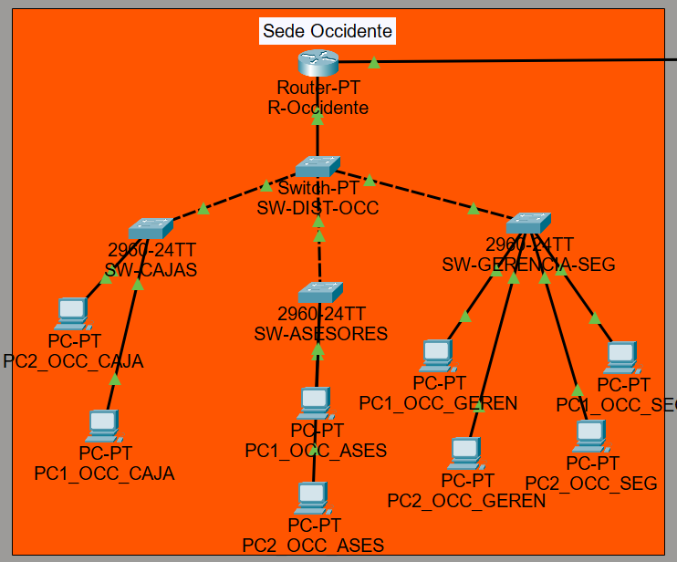

### 6.3 Dispositivos de la Sede

| Dispositivo | Rol | VTP | Descripción |
|-------------|-----|-----|-------------|
| R-Occidente | Router de borde, inter-VLAN | N/A | Router-on-a-Stick con subinterfaces |
| SW-DIST-OCC | Switch de distribución | **Server** | Propaga VLANs a todos los accesos |
| SW-CAJAS | Switch de acceso | Client | Hosts VLAN Cajas (14) |
| SW-ASESORES | Switch de acceso | Client | Hosts VLAN Asesores (24) |
| SW-GERENCIA-SEG | Switch de acceso | Client | Hosts VLAN Gerencia (34) y Seguridad (44) |

### 6.4 Mapeo de Puertos

| Switch | Puerto | Tipo | VLAN(s) |
|--------|--------|------|---------|
| SW-DIST-OCC | GigE0/1 | **Trunk** | 14, 24, 34, 44 → R-Occidente |
| SW-DIST-OCC | GigE0/2 | **Trunk** | 14, 24, 34, 44 → SW-CAJAS |
| SW-DIST-OCC | GigE0/3 | **Trunk** | 14, 24, 34, 44 → SW-ASESORES |
| SW-DIST-OCC | GigE0/4 | **Trunk** | 14, 24, 34, 44 → SW-GERENCIA-SEG |
| SW-CAJAS | Fa0/1-10 | **Acceso** | 14 (Cajas) |
| SW-ASESORES | Fa0/1-8 | **Acceso** | 24 (Asesores) |
| SW-GERENCIA-SEG | Fa0/1-5 | **Acceso** | 34 (Gerencia) |
| SW-GERENCIA-SEG | Fa0/6-10 | **Acceso** | 44 (Seguridad) |

### 6.6 Captura de Configuración VTP

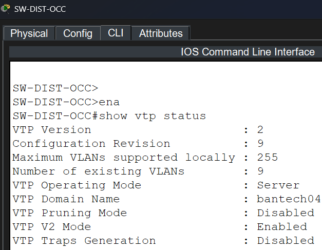

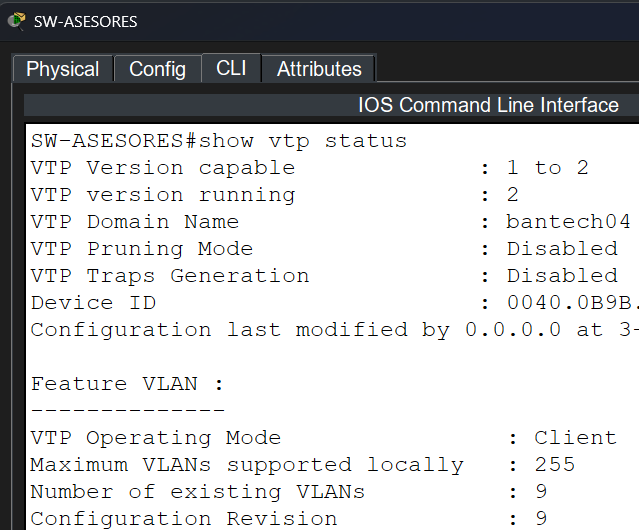

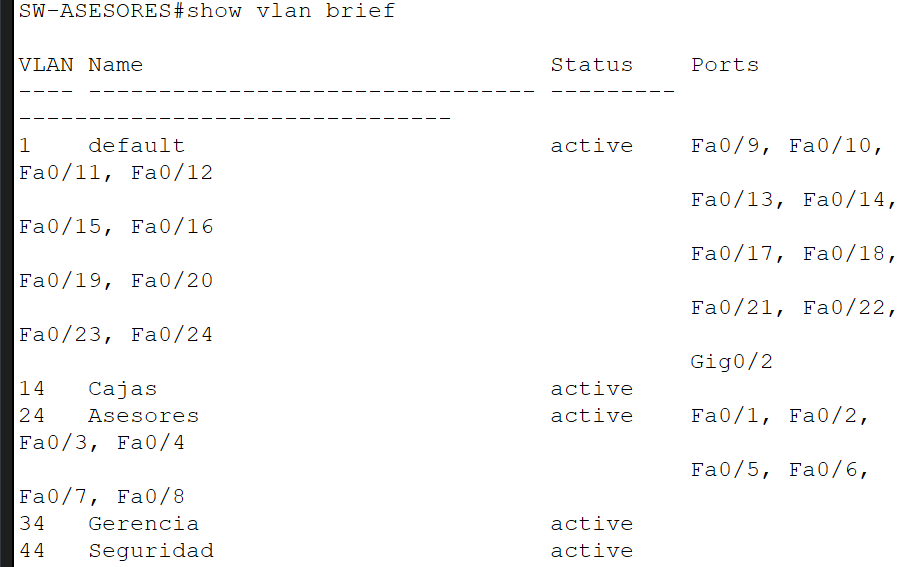

### 6.7 Captura de Subinterfaces (Router-on-a-Stick)

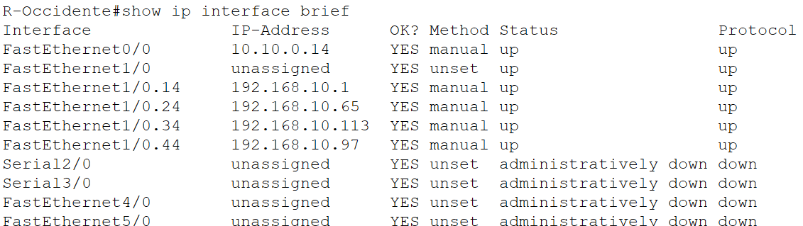

---

## 7. Sede Norte — Centro de Autorización de Créditos

### 7.1 Justificación de Arquitectura

Se implementó una **topología en triángulo (anillo de tres switches)** entre SW-CORE-NORTE, SW-DIST-N1 y SW-DIST-N2. Esta elección responde al requerimiento crítico de la sede: los analistas de riesgo procesan aprobaciones de crédito a nivel nacional, por lo que no puede existir un único punto de falla físico entre los switches de la sede y el router de borde.

El triángulo crea bucles físicos **intencionales** que garantizan que si cualquier enlace entre switches del núcleo falla, el tráfico puede fluir por el camino alternativo. El protocolo **Rapid PVST+** gestiona estos bucles de forma inteligente, bloqueando uno de los puertos redundantes en condiciones normales y activándolo en menos de 1 segundo cuando detecta una falla.

Se eligió **SW-CORE-NORTE como Root Bridge** porque es el switch con conexión directa a R-Norte (router de borde hacia el backbone). Al ser el root, los demás switches calcularán sus caminos de costo mínimo convergiendo hacia él, lo que garantiza que el tráfico hacia el backbone siempre tome el camino más eficiente.

**Ventajas de tolerancia a fallos:** Cualquiera de los tres enlaces del triángulo puede fallar sin que la red pierda conectividad. Rapid PVST+ converge en menos de 2 segundos, minimizando la interrupción del servicio de autorización de créditos.

### 7.3 Dispositivos de la Sede

| Dispositivo | Rol | Prioridad STP | VTP |
|-------------|-----|---------------|-----|
| SW-CORE-NORTE | Switch principal, Root Bridge | **4096** | Server |
| SW-DIST-N1 | Distribución, nodo del anillo | 8192 | Client |
| SW-DIST-N2 | Distribución, nodo del anillo | 8192 | Client |
| SW-ACC-ANALISIS | Acceso VLAN 54 | — | Client |
| SW-ACC-AUDIT | Acceso VLAN 64 | — | Client |
| SW-ACC-LEGAL | Acceso VLAN 74 | — | Client |

### 7.4 Captura de Topología Norte

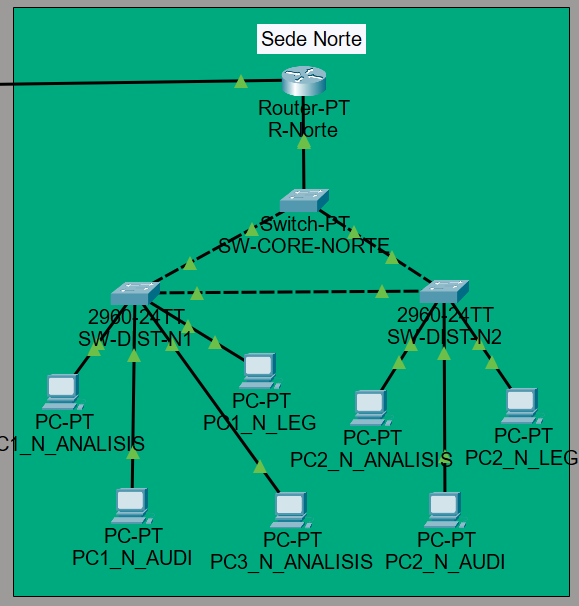

### 7.5 Captura de Rapid PVST+

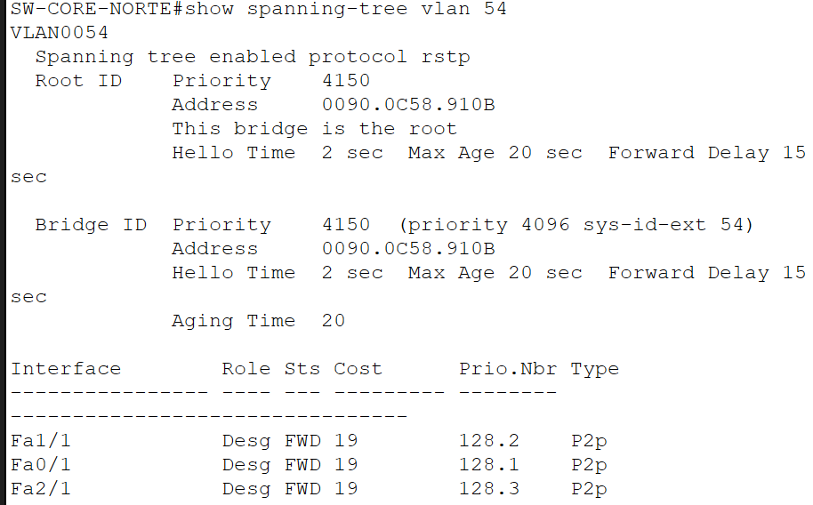

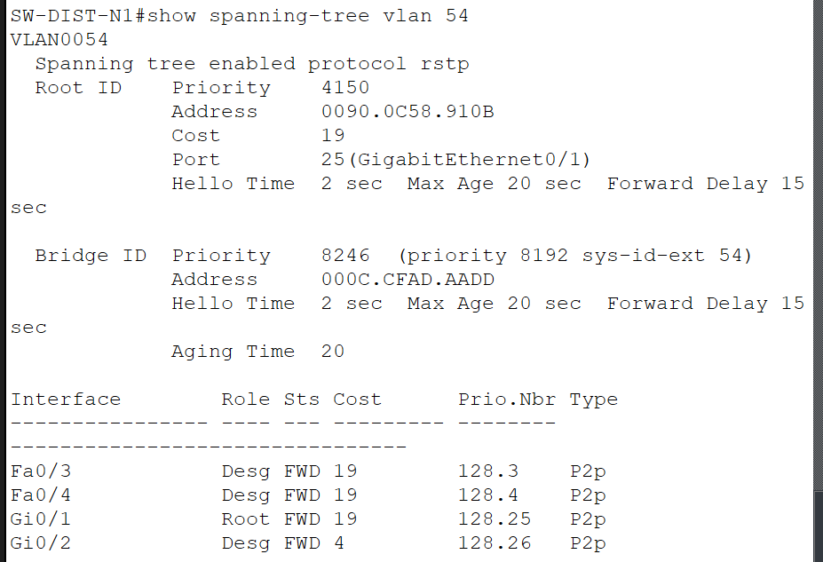

---

## 8. Sede Oriente — Centro Financiero Legado

### 8.1 Justificación de Arquitectura

Se implementó una **topología en estrella dual** con los switches de acceso conectados **simultáneamente** a MS1 y MS2. Esta arquitectura responde directamente al requerimiento de alta disponibilidad del gateway: los hosts deben mantener conectividad hacia el núcleo bancario incluso si MS1 (el switch multicapa principal) sufre un corte de energía total.

El protocolo **HSRP (Hot Standby Router Protocol)** crea una IP virtual por cada VLAN. Los hosts configuran esta IP virtual como su gateway, por lo que son completamente transparentes al proceso de failover. MS1 opera como router **Activo** (prioridad 110) y MS2 como **Standby** (prioridad 100). Cuando MS1 falla, MS2 asume el rol activo en aproximadamente 3 segundos, y el tráfico de los hosts continúa fluyendo sin necesidad de reconfigurar nada en los equipos finales.

El uso de `preempt` en MS1 garantiza que cuando MS1 se recupere, automáticamente retome el rol activo sin intervención manual.

**Gateways HSRP (IP virtual):**
- VLAN 84 (Bóveda): `192.168.30.65`
- VLAN 94 (Plataforma): `192.168.30.1`

### 8.3 Configuración HSRP — Grupos

| VLAN | Grupo HSRP | IP Virtual | MS1 (Active) | MS2 (Standby) |
|------|-----------|-----------|-------------|--------------|
| 84 — Bóveda | 84 | 192.168.30.65 | .66 (prioridad 110) | .67 (prioridad 100) |
| 94 — Plataforma | 94 | 192.168.30.1 | .2 (prioridad 110) | .3 (prioridad 100) |

### 8.4 Captura de Topología Oriente

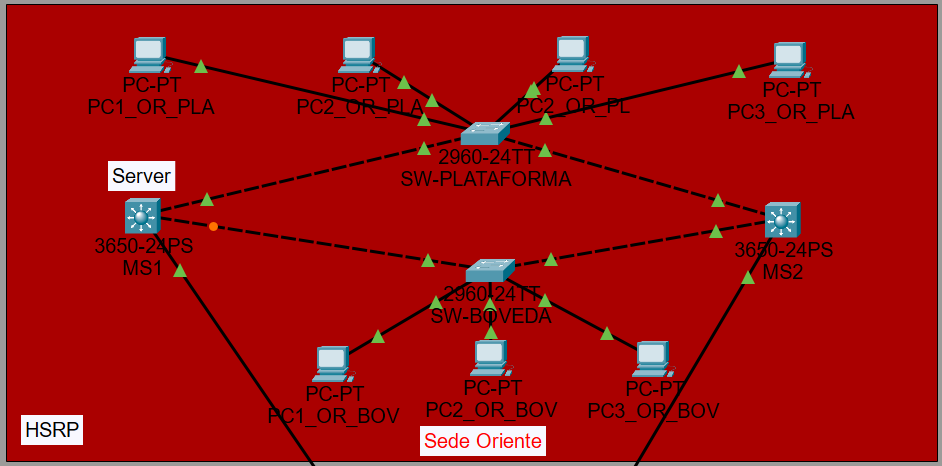

### 8.5 Capturas HSRP

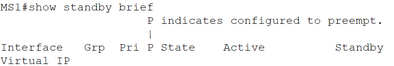

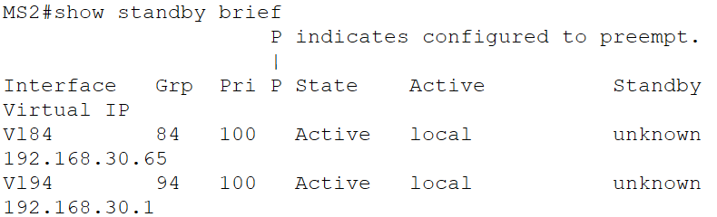

### 8.6 Prueba de Failover HSRP

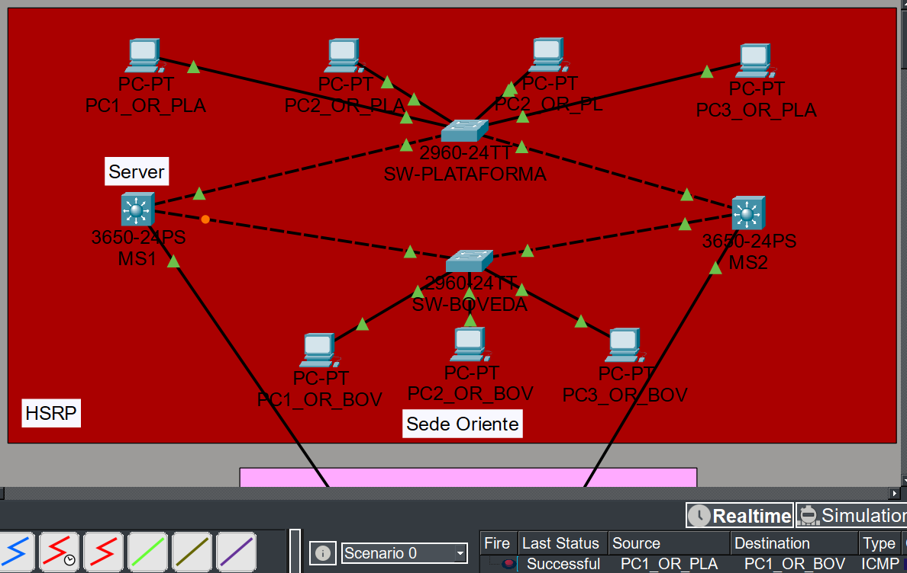

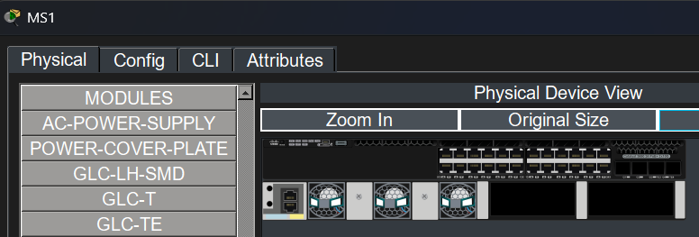

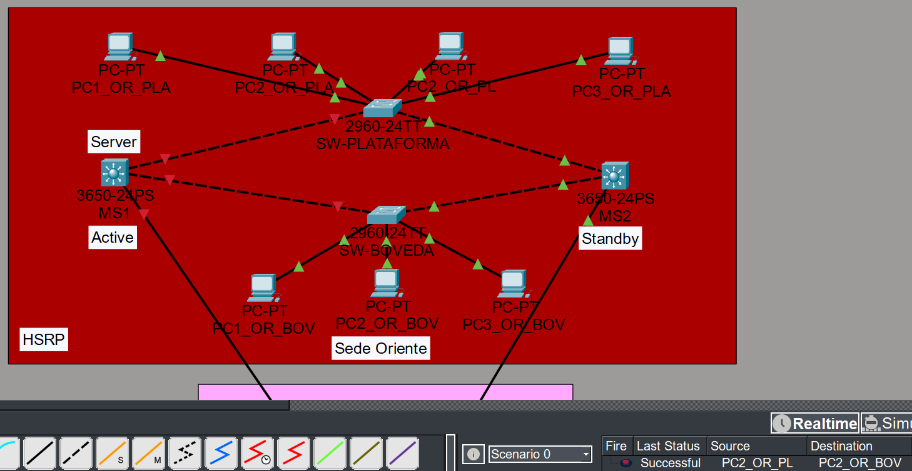

---

## 9. Data Center y Sede Central — Alta Seguridad

### 9.1 Justificación de Arquitectura

Se implementó una **arquitectura de dos capas** (distribución + acceso) con **EtherChannel LACP** en el enlace crítico hacia los servidores de base de datos. Esta sede aloja los activos más sensibles del banco (servidores de BD, banca virtual y NOC), por lo que requiere el mayor ancho de banda disponible y está aislada en un segmento de rutas estáticas por políticas estrictas de seguridad.

El **EtherChannel LACP** entre SW-DIST-DC y SW-ACC-BD agrega 2 interfaces físicas en un solo canal lógico, duplicando el ancho de banda disponible (2 Gbps en lugar de 1 Gbps) y proporcionando redundancia: si uno de los cables físicos falla, el tráfico continúa por el cable restante sin interrupción.

El uso de rutas estáticas (en lugar de protocolos dinámicos) es una decisión de seguridad deliberada: solo las rutas explícitamente configuradas pueden entrar o salir de este segmento, reduciendo la superficie de ataque frente a inyección de rutas maliciosas. R-Central1 redistribuye estas rutas hacia OSPF de forma controlada.

**Arquitectura de EtherChannel en el Data Center:**
- **Port-channel1 (LACP):** SW-DIST-DC ↔ SW-ACC-BD (enlace de distribución, 2 Gbps) ⭐
- **Port-channel3 (LACP):** SW-DIST-DC ↔ SW-ACC-WEB (enlace de distribución, 2 Gbps) ⭐
- **Enlace simple:** SW-ACC-BD ↔ Servidores Core_BD (acceso normal)
- **Enlace simple:** SW-ACC-WEB ↔ Servidores Web_Apps (acceso normal)
- **Enlace simple:** SW-DIST-DC ↔ SW-ACC-NOC (monitoreo, sin EtherChannel)

> 📝 **EtherChannel SOLO en distribución (Po1, Po3):** Duplican ancho de banda entre switches. Enlaces a servidores son simples.

### 9.3 Configuración EtherChannel

#### Port-channel1: SW-DIST-DC ↔ SW-ACC-BD (Enlace de Distribución)

| Parámetro | Valor |
|-----------|-------|
| Modo | LACP (activo en ambos extremos) |
| Interfaces | GigabitEthernet0/1 y GigabitEthernet0/2 |
| Port-channel | Po1 |
| Tipo de enlace | Trunk 802.1Q |
| VLANs permitidas | 14, 24, 34 |
| Ancho de banda | 2 Gbps (agregación) |

#### Port-channel3: SW-DIST-DC ↔ SW-ACC-WEB (Enlace de Distribución)

| Parámetro | Valor |
|-----------|-------|
| Modo | LACP (activo en ambos extremos) |
| Interfaces | GigabitEthernet0/3 y GigabitEthernet0/4 |
| Port-channel | Po3 |
| Tipo de enlace | Trunk 802.1Q |
| VLANs permitidas | 14, 24, 34 |
| Ancho de banda | 2 Gbps (agregación) |

#### Enlace Simple: SW-ACC-BD ↔ Servidores Core_BD (Acceso)

| Parámetro | Valor |
|-----------|-------|
| Puerto | GigabitEthernet0/3 |
| Tipo de enlace | Acceso (VLAN 14) |
| VLAN | 14 (Core_BD) |
| Ancho de banda | 1 Gbps (simple) |

#### Enlace Simple: SW-ACC-WEB ↔ Servidores Web_Apps (Acceso)

| Parámetro | Valor |
|-----------|-------|
| Puerto | GigabitEthernet0/3 |
| Tipo de enlace | Acceso (VLAN 24) |
| VLAN | 24 (Web_Apps) |
| Ancho de banda | 1 Gbps (simple) |

> 📝 **Conclusión:** EtherChannel SOLO en distribución (Po1, Po3 entre switches). Enlaces a servidores son simples (suficientes para monitoreo).

### 9.4 Captura de Topología Data Center

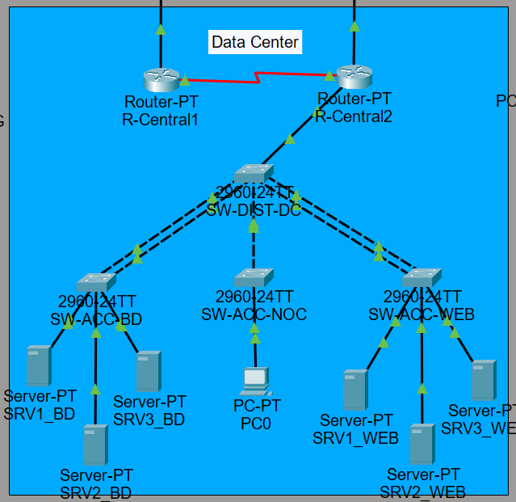

### 9.5 Capturas EtherChannel

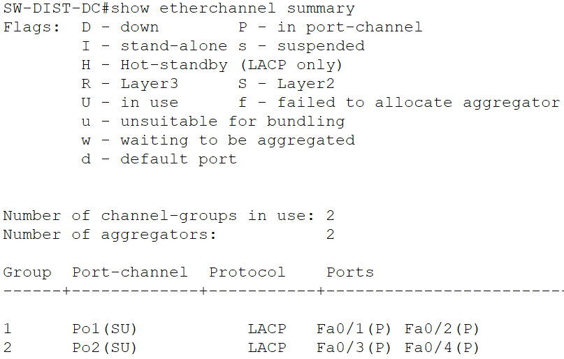

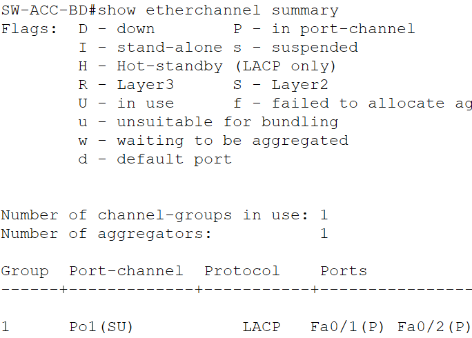

---

## 10. Configuraciones Clave de Dispositivos

### 10.1 Core1 — Router Principal del Backbone

```
hostname Core1
!
! === Interfaces ===
interface Port-channel1
 description ETHERCHANNEL-FIBRA-Core1-Core2
 ip address 10.10.0.1 255.255.255.252
!
interface GigabitEthernet0/2
 description ENLACE-Core1-Core3
 ip address 10.10.0.5 255.255.255.252
!
interface GigabitEthernet0/3
 description ENLACE-Core1-R-Occidente-EIGRP
 ip address 10.10.0.13 255.255.255.252
!
interface GigabitEthernet0/4
 description ENLACE-Core1-R-Central1
 ip address 10.10.0.29 255.255.255.252
!
! === OSPF ===
router ospf 1
 router-id 1.1.1.1
 network 10.10.0.0 0.0.0.3 area 0
 network 10.10.0.4 0.0.0.3 area 0
 network 10.10.0.28 0.0.0.3 area 0
 passive-interface GigabitEthernet0/3
 redistribute eigrp 100 subnets
!
! === EIGRP (redistribución) ===
router eigrp 100
 network 10.10.0.12 0.0.0.3
 no auto-summary
 redistribute ospf 1 metric 10000 100 255 1 1500
!
! === Rutas estáticas hacia Data Center ===
ip route 192.168.40.0 255.255.255.0 10.10.0.30
```

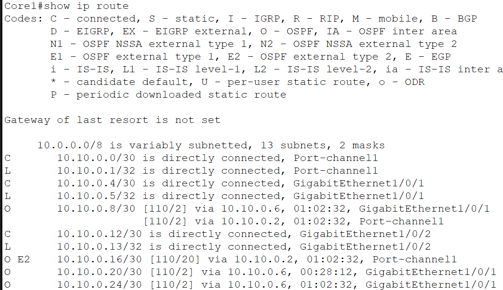

---

### 10.2 Core2 — Redistribución OSPF-RIPv2

```
hostname Core2
!
! === OSPF con redistribución hacia RIP ===
router ospf 1
 router-id 2.2.2.2
 network 10.10.0.0 0.0.0.3 area 0
 network 10.10.0.8 0.0.0.3 area 0
 network 10.10.0.32 0.0.0.3 area 0
 redistribute rip subnets
!
! === RIPv2 con redistribución desde OSPF ===
router rip
 version 2
 network 10.10.0.16
 no auto-summary
 redistribute ospf 1 metric 5
```

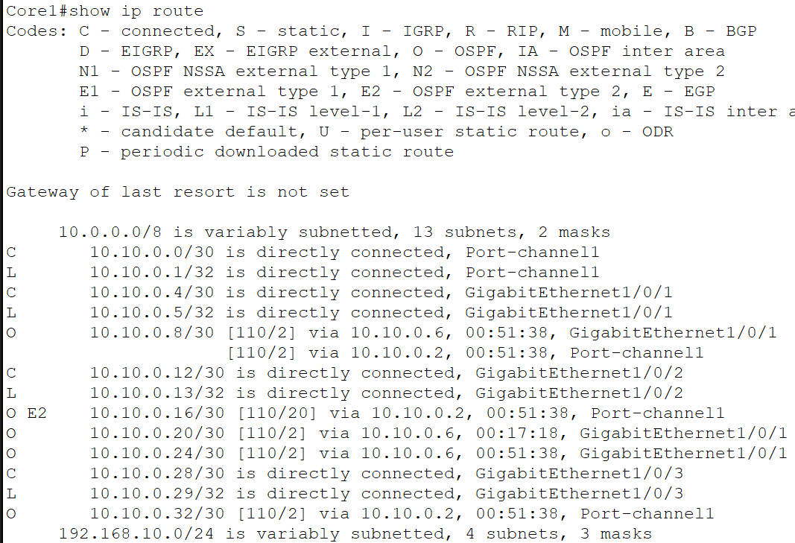

---

### 10.3 R-Occidente — Router-on-a-Stick

```
hostname R-Occidente
!
interface GigabitEthernet0/0
 description ENLACE-BACKBONE
 ip address 10.10.0.14 255.255.255.252
!
interface GigabitEthernet0/1
 no ip address
 no shutdown
!
interface GigabitEthernet0/1.14
 encapsulation dot1Q 14
 ip address 192.168.10.1 255.255.255.192
!
interface GigabitEthernet0/1.24
 encapsulation dot1Q 24
 ip address 192.168.10.65 255.255.255.224
!
interface GigabitEthernet0/1.34
 encapsulation dot1Q 34
 ip address 192.168.10.113 255.255.255.240
!
interface GigabitEthernet0/1.44
 encapsulation dot1Q 44
 ip address 192.168.10.97 255.255.255.240
!
router eigrp 100
 network 10.10.0.12 0.0.0.3
 network 192.168.10.0 0.0.0.255
 no auto-summary
```

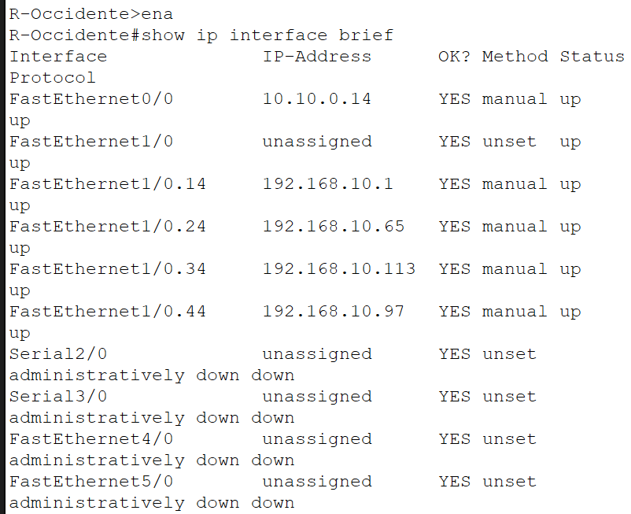

---

### 10.4 MS1 — HSRP Active (Oriente)

```
hostname MS1
ip routing
!
interface Vlan84
 ip address 192.168.30.66 255.255.255.192
 standby 84 ip 192.168.30.65
 standby 84 priority 110
 standby 84 preempt
!
interface Vlan94
 ip address 192.168.30.2 255.255.255.192
 standby 94 ip 192.168.30.1
 standby 94 priority 110
 standby 94 preempt
!
router ospf 1
 router-id 11.11.11.11
 network 10.10.0.20 0.0.0.3 area 0
 network 192.168.30.0 0.0.0.63 area 0
 network 192.168.30.64 0.0.0.63 area 0
```

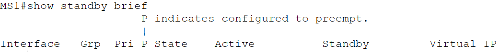

---

### 10.5 SW-DIST-DC — EtherChannel LACP (Distributor)

```
hostname SW-DIST-DC
!
! === Port-channel1 a SW-ACC-BD (trunk) ===
interface range GigabitEthernet0/1 - 2
 channel-group 1 mode active
 no shutdown
!
interface Port-channel1
 switchport mode trunk
 switchport trunk allowed vlan 14,24,34
 no shutdown
!
! === Port-channel3 a SW-ACC-WEB (trunk) ===
interface range GigabitEthernet0/3 - 4
 channel-group 3 mode active
 no shutdown
!
interface Port-channel3
 switchport mode trunk
 switchport trunk allowed vlan 14,24,34
 no shutdown
!
! === Enlace normal a SW-ACC-NOC (trunk, sin EtherChannel) ===
interface GigabitEthernet0/5
 switchport mode trunk
 switchport trunk allowed vlan 14,24,34
 no shutdown
```

### 10.6 SW-ACC-BD — Enlace simple a Servidores Core_BD (acceso)

```
hostname SW-ACC-BD
!
! === Recibe Port-channel1 desde SW-DIST-DC (trunk) ===
interface Port-channel1
 switchport mode trunk
 switchport trunk allowed vlan 14,24,34
 no shutdown
!
! === Enlace simple hacia Servidores de Base de Datos (acceso VLAN 14) ===
interface GigabitEthernet0/3
 switchport mode access
 switchport access vlan 14
 description Enlace-Servidores-Core-BD
 no shutdown
```

### 10.6b SW-ACC-WEB — Enlace simple a Servidores Web_Apps (acceso)

```
hostname SW-ACC-WEB
!
! === Recibe Port-channel3 desde SW-DIST-DC (trunk) ===
interface Port-channel3
 switchport mode trunk
 switchport trunk allowed vlan 14,24,34
 no shutdown
!
! === Enlace simple hacia Servidores de Banca Virtual (acceso VLAN 24) ===
interface GigabitEthernet0/3
 switchport mode access
 switchport access vlan 24
 description Enlace-Servidores-Web-Apps
 no shutdown
```

### 10.6c SW-ACC-NOC — Enlace Simple (SIN EtherChannel)

```
hostname SW-ACC-NOC
!
! === Recibe enlace simple desde SW-DIST-DC (trunk) ===
interface GigabitEthernet0/1
 switchport mode trunk
 switchport trunk allowed vlan 14,24,34
 no shutdown
!
! === Acceso a hosts de NOC (VLAN 34) ===
interface range GigabitEthernet0/2 - 5
 switchport mode access
 switchport access vlan 34
 no shutdown
```

**Justificación:**
- Enlaces simples a servidores: suficientes para monitoreo
- **EtherChannel solo en distribución:** Po1 (BD) y Po3 (WEB) duplican ancho de banda entre switches

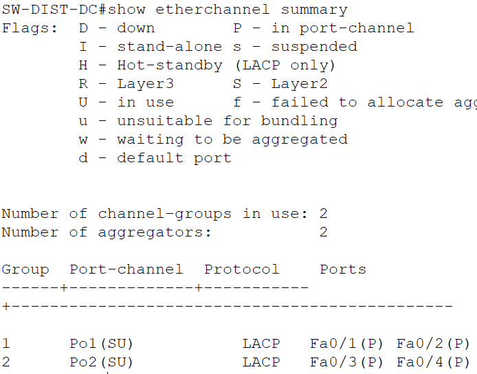

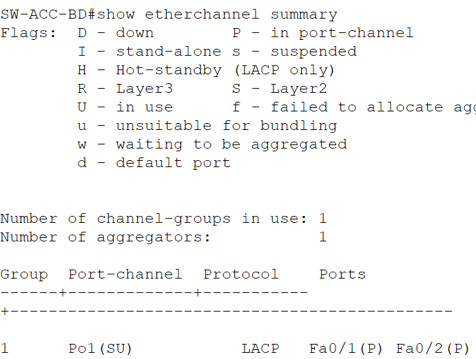

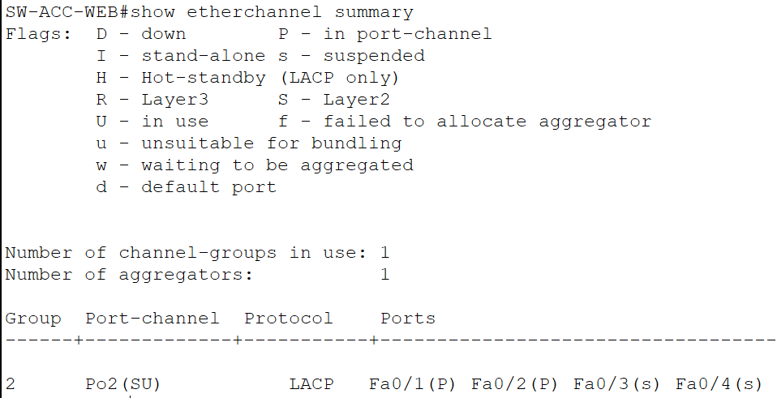

---

### 10.7 R-Central1 — Redistribución Estáticas → OSPF (Inciso 5.4 del PDF) ⭐

```
hostname R-Central1
!
interface GigabitEthernet0/0
 description ENLACE-BACKBONE-Core1
 ip address 10.10.0.30 255.255.255.252
 no shutdown
!
! === Rutas estáticas hacia Data Center ===
ip route 192.168.40.0 255.255.255.0 192.168.40.254
!
! === OSPF (redistribución de estáticas hacia backbone) ===
router ospf 1
 router-id 5.5.5.5
 network 10.10.0.28 0.0.0.3 area 0
 redistribute static subnets
!
exit
```

**Justificación del inciso 5.4:**
> "Dado que este segmento usa enrutamiento estático, el estudiante debe asegurar que R-Central1 redistribuya o propague estas rutas hacia el OSPF del backbone."

R-Central1 anuncia la red 192.168.40.0/24 (Data Center completo) a todos los routers OSPF del backbone. Esto permite que sedes Occidente, Norte y Oriente accedan al Data Center.

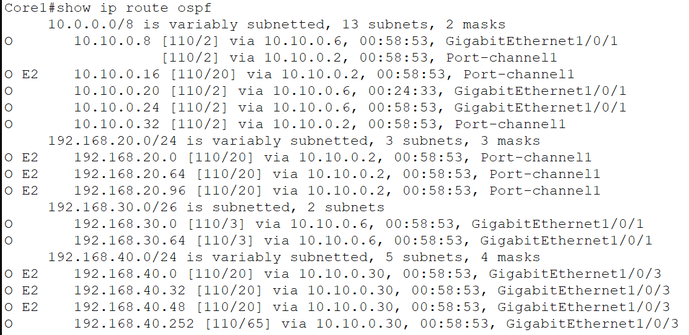

---

### 10.8 R-Central2 — Router-on-a-Stick (Gateway de VLANs Data Center)

```
hostname R-Central2
!
! === Enlace trunk hacia SW-DIST-DC ===
interface GigabitEthernet0/0
 description ENLACE-SW-DIST-DC-TRUNK
 no ip address
 no shutdown
!
! === Subinterfaz VLAN 14 (Core_BD) ===
interface GigabitEthernet0/0.14
 encapsulation dot1Q 14
 ip address 192.168.40.33 255.255.255.240
 description Gateway-VLAN14-Core_BD
 no shutdown
!
! === Subinterfaz VLAN 24 (Web_Apps) ===
interface GigabitEthernet0/0.24
 encapsulation dot1Q 24
 ip address 192.168.40.1 255.255.255.224
 description Gateway-VLAN24-Web_Apps
 no shutdown
!
! === Subinterfaz VLAN 34 (NOC) ===
interface GigabitEthernet0/0.34
 encapsulation dot1Q 34
 ip address 192.168.40.49 255.255.255.240
 description Gateway-VLAN34-NOC
 no shutdown
!
exit
```

**Justificación:**
- R-Central2 proporciona los **gateways de capa 3** para las tres VLANs del Data Center
- Su interfaz GigabitEthernet0/0 conecta al **SW-DIST-DC** con un enlace trunk 802.1Q
- Las subinterfaces enrutan el tráfico inter-VLAN dentro del segmento Data Center

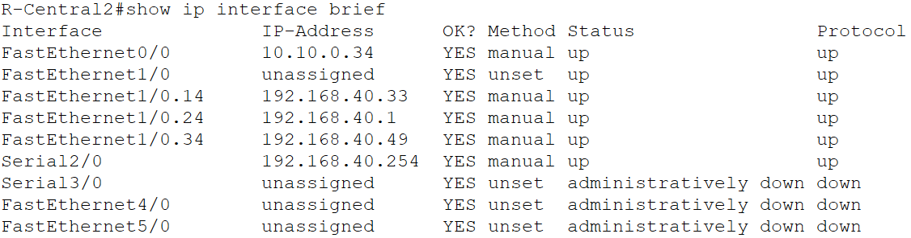

---

### 10.9 SW-CORE-NORTE — Root Bridge (Norte)

```
hostname SW-CORE-NORTE
!
spanning-tree mode rapid-pvst
spanning-tree vlan 54 priority 4096
spanning-tree vlan 64 priority 4096
spanning-tree vlan 74 priority 4096
!
vtp mode server
vtp domain bantech04
vtp password cisco
!
vlan 54
 name Analisis
vlan 64
 name Auditoria
vlan 74
 name Legal
```

---

## 11. Pruebas de Conectividad y Alta Disponibilidad

### 11.1 Convergencia Total de la Red

#### Ping Occidente → Data Center

Origen: PC en VLAN Cajas Occidente (`192.168.10.10`)
Destino: Servidor Core_BD Data Center (`192.168.40.35`)

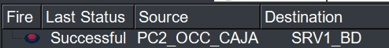

#### Ping Norte → Oriente

Origen: PC en VLAN Análisis Norte (`192.168.20.10`)
Destino: PC en VLAN Bóveda Oriente (`192.168.30.70`)

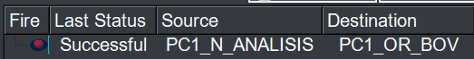

---

### 11.2 Redistribución de Rutas — Tablas de Enrutamiento


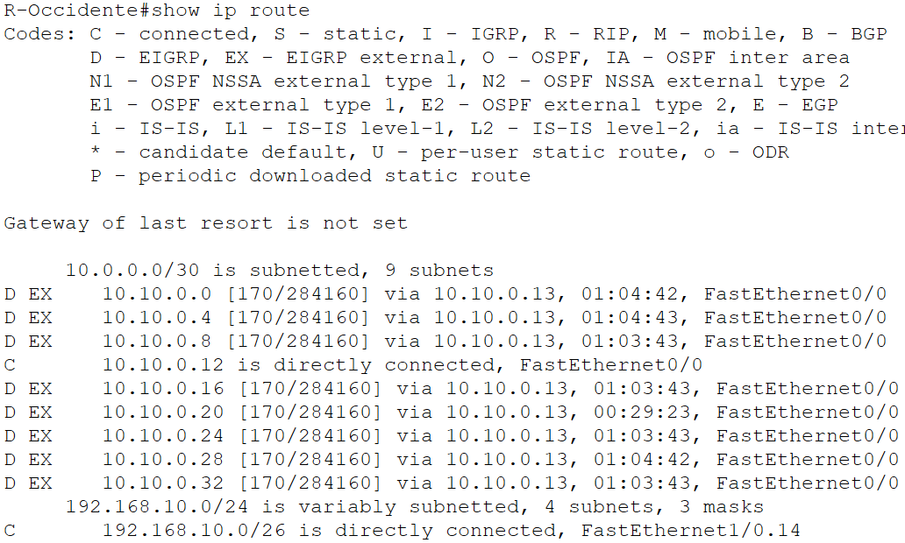

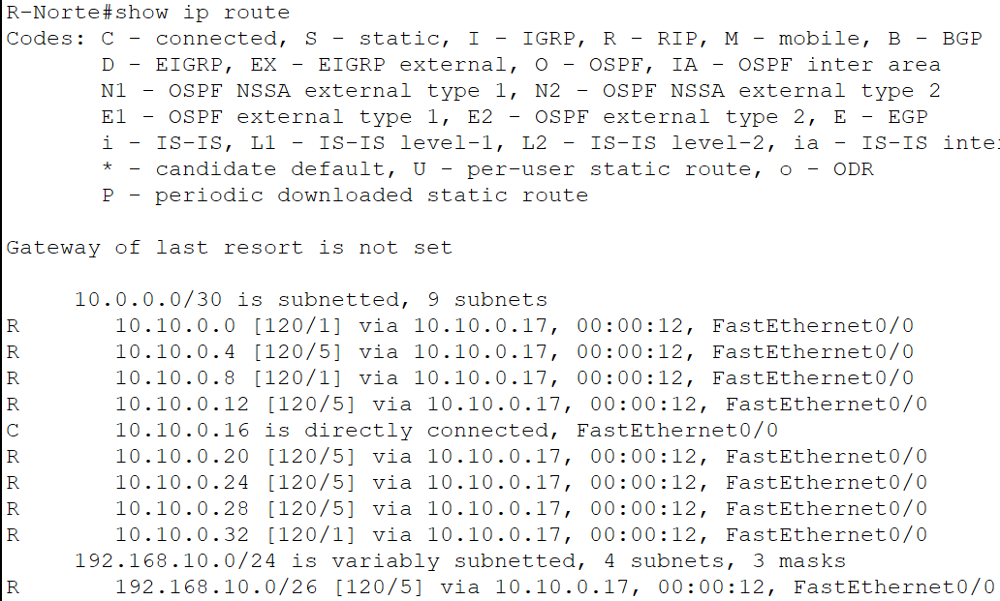

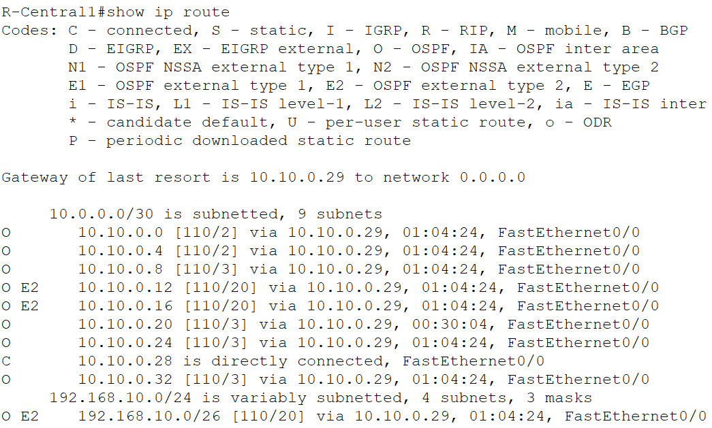

---

### 11.3 Prueba de Failover HSRP — Sede Oriente

**Estado inicial (MS1 activo):**


**Procedimiento:**
1. Iniciar ping continuo desde PC en Oriente: `ping 192.168.30.70 repeat 1000`
2. Apagar MS1 (Physical → Power off, o `shutdown` en interfaz de uplink)
3. Observar convergencia

**Estado durante failover:**

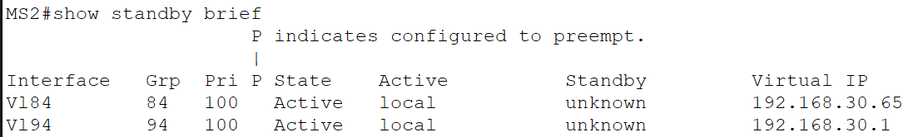

**Estado post-failover:**

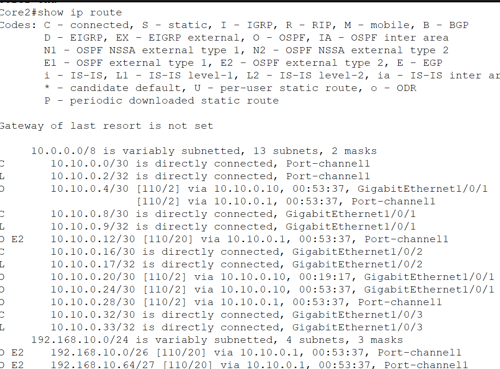

**Análisis:** La pérdida de paquetes durante el failover es de aproximadamente 3 segundos (tiempo de detección HSRP por defecto). Esto es aceptable para la mayoría de sesiones TCP bancarias. Se podría reducir ajustando los timers `standby X timers msec 250 msec 750`.

---

### 11.4 Prueba de Failover STP — Sede Norte

**Estado inicial (puerto en Blocking):**


**Procedimiento:**
1. Desconectar cable entre SW-CORE-NORTE y SW-DIST-N1
2. Observar convergencia de Rapid PVST+

**Estado post-failover:**


---

### 11.5 Verificación EtherChannel Data Center

#### Port-channel1 (SW-DIST-DC ↔ SW-ACC-BD)


#### Port-channel3 (SW-DIST-DC ↔ SW-ACC-WEB)


#### Verificación de enlaces a servidores


---

### 11.6 Verificación VTP


---

## 12. Conclusiones

1. **Backbone con redistribución múltiple:** La implementación de OSPF como protocolo backbone con redistribución hacia EIGRP, RIPv2 y rutas estáticas permite la interoperabilidad entre dominios de enrutamiento heterogéneos.

2. **Segmentación eficiente con VLSM:** El uso de VLSM permitió asignar bloques de direcciones ajustados a cada VLAN, optimizando direccionamiento.

3. **Alta disponibilidad en múltiples capas:** 
   - **EtherChannel en distribución** (Po1, Po3): Duplican ancho de banda entre switches (2 Gbps)
   - **Rapid PVST+ en Norte:** Redundancia de enlace con convergencia rápida
   - **HSRP en Oriente:** Redundancia de gateway
   - **Rutas estáticas en Data Center:** Seguridad estricta

4. **EtherChannel en Data Center:** ⭐
   - **Port-channel1 (BD):** SW-DIST-DC ↔ SW-ACC-BD (distribución)
   - **Port-channel3 (WEB):** SW-DIST-DC ↔ SW-ACC-WEB (distribución)
   - **Enlaces simples a servidores:** GigE a BD y WEB (suficientes para monitoreo)
   - Mejor eficiencia: agregación donde más se necesita (entre switches)

5. **VTP solo en sedes comerciales, NO en Data Center:**
   - **Occidente y Norte:** VTP Server/Client para gestión centralizada de VLANs
   - **Data Center:** Configuración MANUAL por seguridad estricta

6. **Arquitecturas por sede:**
   - **Occidente:** Estrella jerárquica → simplicidad + aislamiento
   - **Norte:** Triángulo (anillo) → redundancia de Capa 2
   - **Oriente:** Estrella dual → disponibilidad de gateway
   - **Data Center:** Distribución con EtherChannel + rutas estáticas → seguridad

---