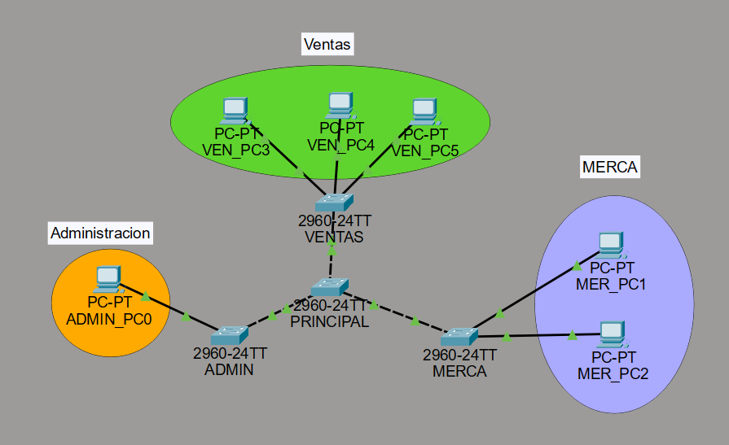
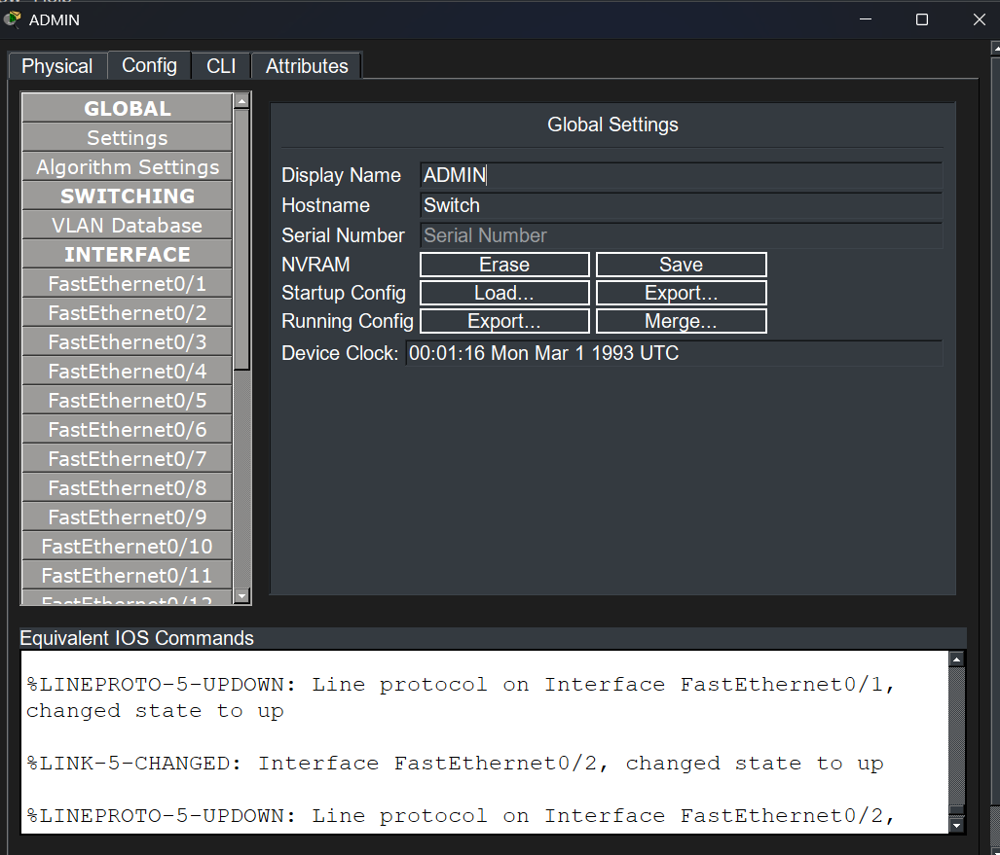
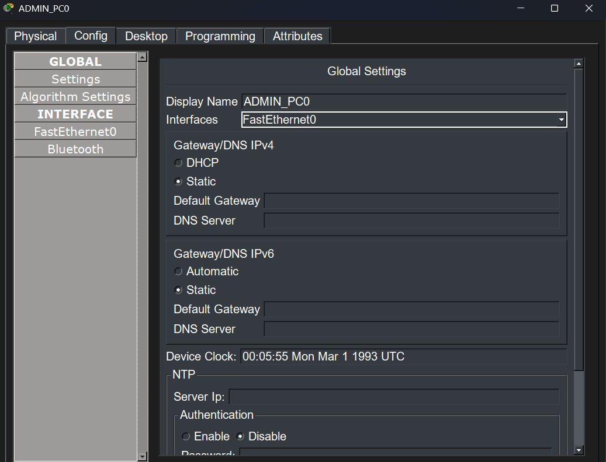
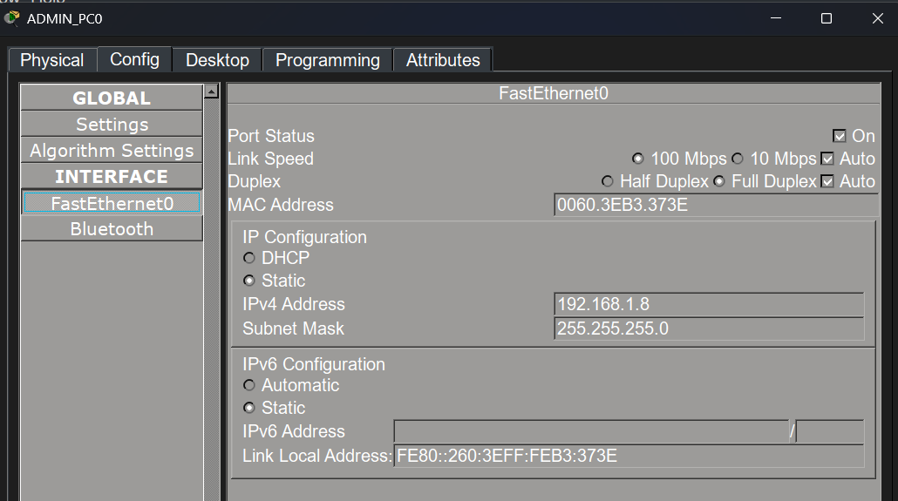
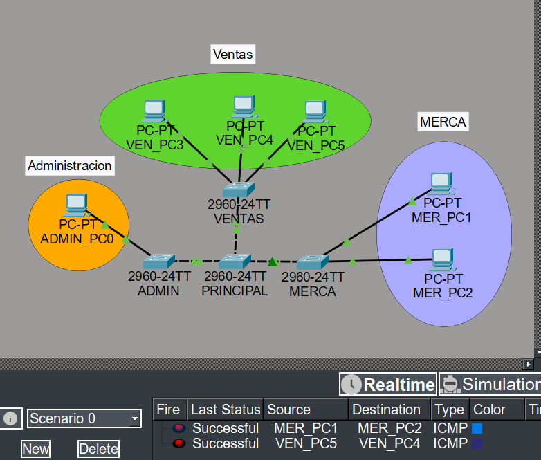

# Manual Técnico — Tarea #3: VLANs y VTP en Cisco Packet Tracer

**Curso:** Redes de Computadoras 1  
**Fecha:** 22 de febrero de 2026  
**Carnet:** 202308204  
**Universidad San Carlos de Guatemala — Facultad de Ingeniería**

---

## Tabla de Contenido

1. [Introducción](#1-introducción)
2. [Topología de la Red](#2-topología-de-la-red)
3. [Tabla de Direcciones IP](#3-tabla-de-direcciones-ip)
4. [Paso 1 — Configuración de Hostnames](#4-paso-1--configuración-de-hostnames)
5. [Paso 2 — Configuración de Direcciones IPv4](#5-paso-2--configuración-de-direcciones-ipv4)
6. [Paso 3 — Configurar SW_Principal como VTP Server](#6-paso-3--configurar-sw_principal-como-vtp-server)
7. [Paso 4 — Crear las VLANs en el Servidor](#7-paso-4--crear-las-vlans-en-el-servidor)
8. [Paso 5 — Configurar Puertos TRUNK en SW_Principal](#8-paso-5--configurar-puertos-trunk-en-sw_principal)
9. [Paso 6 — Configurar Puertos ACCESS en SW_Principal](#9-paso-6--configurar-puertos-access-en-sw_principal)
10. [Paso 7 — Configurar SW_ADMIN como VTP Client](#10-paso-7--configurar-sw_admin-como-vtp-client)
11. [Paso 8 — Configurar SW_MERCA como VTP Transparent](#11-paso-8--configurar-sw_merca-como-vtp-transparent)
12. [Paso 9 — Configurar SW_VENTAS como VTP Client](#12-paso-9--configurar-sw_ventas-como-vtp-client)
13. [Paso 10 — Verificación: show vtp status](#13-paso-10--verificación-show-vtp-status)
14. [Paso 11 — Verificación: show vlan brief](#14-paso-11--verificación-show-vlan-brief)
15. [Paso 12 — Verificación: show interfaces trunk](#15-paso-12--verificación-show-interfaces-trunk)
16. [Paso 13 — Pruebas de Conectividad (Ping)](#16-paso-13--pruebas-de-conectividad-ping)
17. [Glosario de Comandos](#17-glosario-de-comandos)

---

## 1. Introducción

Esta tarea tiene como objetivo implementar y verificar la segmentación de una red mediante **VLANs** (Virtual Local Area Networks) y el protocolo **VTP** (VLAN Trunking Protocol) en cuatro switches Cisco 2960 simulados en **Cisco Packet Tracer**.

Se configuran tres modos de VTP (Servidor, Cliente y Transparente) y tres VLANs departamentales:

| VLAN ID | Nombre   | Función                                |
|---------|----------|----------------------------------------|
| 10      | ADMIN    | Red del departamento Administración    |
| 20      | MERCA    | Red del departamento Mercadeo          |
| 30      | VENTAS   | Red del departamento Ventas            |

La configuración se verifica usando los comandos `show vtp status`, `show vlan brief` y `show interfaces trunk`, así como pruebas de conectividad con `ping`.

---

## 2. Topología de la Red

La red está compuesta por **4 switches Cisco 2960** interconectados mediante enlaces **TRUNK** y **6 PCs** conectadas a los switches de acceso mediante puertos **ACCESS**.

| Dispositivo   | Rol VTP     | Descripción                                           |
|---------------|-------------|-------------------------------------------------------|
| SW_Principal  | Server      | Crea y distribuye las VLANs al dominio VTP            |
| SW_ADMIN      | Client      | Recibe VLANs automáticamente del servidor             |
| SW_MERCA      | Transparent | No propaga VLANs; las crea manualmente de forma local |
| SW_VENTAS     | Client      | Recibe VLANs automáticamente del servidor             |



> **Nota:** Los enlaces entre switches se configuran en modo **TRUNK** para permitir el paso de tráfico de múltiples VLANs. Los enlaces hacia las PCs se configuran en modo **ACCESS** con la VLAN correspondiente.

---

## 3. Tabla de Direcciones IP

| Dispositivo | VLAN       | Dirección IP    | Máscara         | Gateway         |
|-------------|------------|-----------------|-----------------|-----------------|
| PC_ADMIN1   | 10 (ADMIN) | 192.168.10.1    | 255.255.255.0   | 192.168.10.254  |
| PC_ADMIN2   | 10 (ADMIN) | 192.168.10.2    | 255.255.255.0   | 192.168.10.254  |
| PC_MERCA1   | 20 (MERCA) | 192.168.20.1    | 255.255.255.0   | 192.168.20.254  |
| PC_MERCA2   | 20 (MERCA) | 192.168.20.2    | 255.255.255.0   | 192.168.20.254  |
| PC_VENTAS1  | 30 (VENTAS)| 192.168.30.1    | 255.255.255.0   | 192.168.30.254  |
| PC_VENTAS2  | 30 (VENTAS)| 192.168.30.2    | 255.255.255.0   | 192.168.30.254  |

---

## 4. Paso 1 — Configuración de Hostnames

El primer paso es asignar nombres descriptivos a cada switch y PC para identificarlos fácilmente durante la administración de la red.

### En cada Switch

```bash
enable
configure terminal
hostname SW_Principal   ! Cambiar según el switch: SW_ADMIN, SW_MERCA, SW_VENTAS
end
```



### En cada PC

Desde la pestaña **Desktop > IP Configuration**, se asigna el nombre al host de cada PC.



**¿Qué hace el comando `hostname`?**  
Asigna un nombre al dispositivo. Este nombre aparece en el prompt de la consola (`SW_Principal#`) y facilita la identificación en la red.

---

## 5. Paso 2 — Configuración de Direcciones IPv4

Se asigna manualmente una dirección IP estática a cada PC según la VLAN a la que pertenece (ver Tabla de Direcciones IP).

Desde **Desktop > IP Configuration** en cada PC:

- **IP Address:** Según tabla
- **Subnet Mask:** 255.255.255.0
- **Default Gateway:** Dirección del gateway de su VLAN



---

## 6. Paso 3 — Configurar SW_Principal como VTP Server

El switch principal actúa como **VTP Server**. Este modo permite crear, modificar y eliminar VLANs que luego se propagan automáticamente a todos los switches en modo **Client** dentro del mismo dominio VTP.

```bash
enable
configure terminal
vtp mode server
vtp domain REDES1
vtp password cisco123
end
```


**Explicación de comandos:**

| Comando                   | Descripción                                                                     |
|---------------------------|---------------------------------------------------------------------------------|
| `vtp mode server`         | Establece el switch en modo Servidor VTP. Puede crear y propagar VLANs.        |
| `vtp domain REDES1`       | Define el nombre del dominio VTP. Todos los switches deben usar el mismo nombre.|
| `vtp password cisco123`   | Contraseña de autenticación del dominio VTP (opcional pero recomendado).        |

> **Importante:** El dominio VTP debe ser idéntico en todos los switches para que la propagación funcione correctamente.

---

## 7. Paso 4 — Crear las VLANs en el Servidor

Con el SW_Principal en modo Server, se crean las tres VLANs del proyecto. Al estar en modo servidor, estas VLANs se propagarán automáticamente a los switches en modo Client.

```bash
enable
configure terminal
vlan 10
 name ADMIN
vlan 20
 name MERCA
vlan 30
 name VENTAS
end
```


**Explicación de comandos:**

| Comando         | Descripción                                                                        |
|-----------------|------------------------------------------------------------------------------------|
| `vlan 10`       | Entra al modo de configuración de la VLAN 10 (la crea si no existe).              |
| `name ADMIN`    | Asigna el nombre "ADMIN" a la VLAN 10 para identificarla descriptivamente.         |
| `vlan 20`       | Crea la VLAN 20.                                                                   |
| `name MERCA`    | Asigna el nombre "MERCA" a la VLAN 20.                                             |
| `vlan 30`       | Crea la VLAN 30.                                                                   |
| `name VENTAS`   | Asigna el nombre "VENTAS" a la VLAN 30.                                            |

---

## 8. Paso 5 — Configurar Puertos TRUNK en SW_Principal

Los puertos que conectan SW_Principal hacia los demás switches deben configurarse en modo **TRUNK** para que puedan transportar tráfico de múltiples VLANs simultáneamente.

```bash
enable
configure terminal
! Repetir para cada puerto que conecta a otro switch (fa0/1, fa0/2, fa0/3 según topología)
interface FastEthernet0/1
 switchport mode trunk
 switchport trunk allowed vlan all
interface FastEthernet0/2
 switchport mode trunk
 switchport trunk allowed vlan all
interface FastEthernet0/3
 switchport mode trunk
 switchport trunk allowed vlan all
end
```


**Explicación de comandos:**

| Comando                              | Descripción                                                                         |
|--------------------------------------|-------------------------------------------------------------------------------------|
| `interface FastEthernet0/1`          | Selecciona el puerto físico a configurar.                                           |
| `switchport mode trunk`              | Establece el puerto como TRUNK. Permite tráfico de múltiples VLANs encapsulado con 802.1Q. |
| `switchport trunk allowed vlan all`  | Permite el paso de todas las VLANs por este enlace trunk.                           |

> **Diferencia entre ACCESS y TRUNK:**  
> - **ACCESS:** Puerto que pertenece a una sola VLAN. Se conecta a dispositivos finales (PCs, servidores).  
> - **TRUNK:** Puerto que transporta tráfico de múltiples VLANs. Se usa entre switches.

---

## 9. Paso 6 — Configurar Puertos ACCESS en SW_Principal

Los puertos conectados directamente a las PCs de la VLAN 10 (ADMIN) se configuran como **ACCESS** en esa VLAN.

```bash
enable
configure terminal
! Puerto donde está conectada PC_ADMIN1
interface FastEthernet0/10
 switchport mode access
 switchport access vlan 10
! Puerto donde está conectada PC_ADMIN2
interface FastEthernet0/11
 switchport mode access
 switchport access vlan 10
end
```


**Explicación de comandos:**

| Comando                       | Descripción                                                                     |
|-------------------------------|---------------------------------------------------------------------------------|
| `switchport mode access`      | Configura el puerto como ACCESS. Solo transporta una VLAN.                     |
| `switchport access vlan 10`   | Asigna el puerto a la VLAN 10 (ADMIN). El tráfico del PC quedará en esa VLAN.  |

---

## 10. Paso 7 — Configurar SW_ADMIN como VTP Client

El switch SW_ADMIN se configura como **VTP Client**. En este modo, el switch no puede crear ni modificar VLANs localmente; las recibe automáticamente del VTP Server. Se configura el puerto hacia SW_Principal como TRUNK y el puerto hacia las PCs como ACCESS en la VLAN 20 (MERCA).

### 7.1 Configurar modo VTP Client y puerto TRUNK

```bash
enable
configure terminal
vtp mode client
vtp domain REDES1
vtp password cisco123
! Puerto hacia SW_Principal
interface FastEthernet0/1
 switchport mode trunk
 switchport trunk allowed vlan all
end
```


### 7.2 Configurar puerto ACCESS para PC0 en VLAN 20

```bash
enable
configure terminal
interface FastEthernet0/10
 switchport mode access
 switchport access vlan 20
end
```


**Explicación:**

| Comando          | Descripción                                                                                  |
|------------------|----------------------------------------------------------------------------------------------|
| `vtp mode client`| El switch pasa a modo Cliente VTP. Recibe las VLANs del servidor automáticamente.            |
| `vtp domain`     | Debe coincidir exactamente con el dominio configurado en el servidor.                        |

---

## 11. Paso 8 — Configurar SW_MERCA como VTP Transparent

El switch SW_MERCA se configura en modo **Transparent**. Este modo es especial: el switch **no aprende ni propaga** las VLANs del dominio VTP, pero sí **reenvía** los mensajes VTP hacia otros switches. Sus VLANs se crean y gestionan **localmente y de forma manual**.

### 8.1 Configurar modo Transparent y puerto TRUNK

```bash
enable
configure terminal
vtp mode transparent
vtp domain REDES1
! Puerto hacia SW_Principal
interface FastEthernet0/1
 switchport mode trunk
 switchport trunk allowed vlan all
end
```


> En una etapa inicial también se exploró el modo Client en SW_MERCA antes de decidir configurarlo como Transparent:


### 8.2 Crear VLANs manualmente en SW_MERCA

Al estar en modo Transparent, las VLANs deben crearse de forma local:

```bash
enable
configure terminal
vlan 10
 name ADMIN
vlan 20
 name MERCA
vlan 30
 name VENTAS
end
```


### 8.3 Configurar puertos ACCESS en SW_MERCA

```bash
enable
configure terminal
interface FastEthernet0/10
 switchport mode access
 switchport access vlan 30
interface FastEthernet0/11
 switchport mode access
 switchport access vlan 30
end
```


**Diferencia clave entre los modos VTP:**

| Modo        | Crea VLANs | Propaga VLANs | Aprende VLANs | Reenvía mensajes VTP |
|-------------|-----------|---------------|---------------|----------------------|
| Server      | ✅ Sí     | ✅ Sí         | ✅ Sí         | ✅ Sí                |
| Client      | ❌ No     | ❌ No         | ✅ Sí         | ✅ Sí                |
| Transparent | ✅ Sí     | ❌ No         | ❌ No         | ✅ Sí                |

---

## 12. Paso 9 — Configurar SW_VENTAS como VTP Client

SW_VENTAS, al igual que SW_ADMIN, opera como **VTP Client**. Las VLANs son recibidas automáticamente desde el servidor.

```bash
enable
configure terminal
vtp mode client
vtp domain REDES1
vtp password cisco123
! Puerto hacia SW_Principal como TRUNK
interface FastEthernet0/1
 switchport mode trunk
 switchport trunk allowed vlan all
! Puertos hacia PCs como ACCESS en VLAN 30 (VENTAS)
interface FastEthernet0/10
 switchport mode access
 switchport access vlan 30
interface FastEthernet0/11
 switchport mode access
 switchport access vlan 30
end
```

---

## 13. Paso 10 — Verificación: `show vtp status`

Una vez configurados todos los switches, se verifica el estado del protocolo VTP con el comando `show vtp status`.

```bash
show vtp status
```

### Resultado en SW_Principal (Server)


**Campos importantes en la salida del comando:**

| Campo                        | Descripción                                                                         |
|------------------------------|-------------------------------------------------------------------------------------|
| `VTP Version`                | Versión del protocolo VTP en uso (generalmente versión 1 o 2).                    |
| `Configuration Revision`     | Número de revisión. Se incrementa cada vez que se modifica la base de datos de VLANs en el servidor. |
| `Maximum VLANs supported`    | Número máximo de VLANs que el switch puede soportar.                              |
| `Number of existing VLANs`   | Cantidad total de VLANs actualmente configuradas, incluyendo las VLANs por defecto de Cisco (1, 1002-1005). |
| `VTP Operating Mode`         | Modo de operación actual: **Server**, **Client** o **Transparent**.               |
| `VTP Domain Name`            | Nombre del dominio VTP configurado.                                               |
| `VTP Pruning Mode`           | Indica si el Pruning (poda de tráfico) está habilitado o deshabilitado.           |
| `VTP V2 Mode`                | Indica si se usa VTP versión 2.                                                   |
| `MD5 digest`                 | Hash de autenticación para verificar integridad del dominio VTP.                 |

**¿Por qué es importante el `Configuration Revision`?**  
Un número de revisión **más alto** tiene prioridad. Si un switch Client o Transparent con revisión más alta que el Server se conecta a la red, puede **sobrescribir la base de datos de VLANs**. Por ello, siempre se debe reiniciar la revisión de un switch antes de integrarlo a la red.

---

## 14. Paso 11 — Verificación: `show vlan brief`

Este comando muestra un resumen de todas las VLANs existentes en el switch y los puertos asignados a cada una.

```bash
show vlan brief
```

### SW_Principal


### SW_ADMIN


### SW_MERCA


### SW_VENTAS


**Columnas de la salida:**

| Columna       | Descripción                                                                           |
|---------------|---------------------------------------------------------------------------------------|
| `VLAN`        | Número identificador de la VLAN.                                                     |
| `Name`        | Nombre asignado (ADMIN, MERCA, VENTAS o `VLAN000X` por defecto).                    |
| `Status`      | `active` = VLAN activa y funcional. `act/lshut` = activa pero apagada localmente.    |
| `Ports`       | Lista de puertos en modo ACCESS asignados a esa VLAN.                                |

> **Observación clave:** En SW_ADMIN y SW_VENTAS (modo Client), las VLANs 10, 20 y 30 aparecen automáticamente porque fueron propagadas por VTP desde el servidor. En SW_MERCA (modo Transparent), aparecen porque fueron creadas **manualmente**.

---

## 15. Paso 12 — Verificación: `show interfaces trunk`

Este comando lista todos los puertos del switch que están operando en modo TRUNK y las VLANs que están permitidas sobre ellos.

```bash
show interfaces trunk
```

### SW_Principal — Todos los trunks activos


**Columnas de la salida:**

| Columna               | Descripción                                                                      |
|-----------------------|----------------------------------------------------------------------------------|
| `Port`                | Nombre del puerto en modo trunk.                                                 |
| `Mode`                | Modo del trunk: `on` (forzado), `desirable`, `auto`, etc.                        |
| `Encapsulation`       | Protocolo de encapsulación: `802.1q` (estándar IEEE para VLANs en trunk).        |
| `Status`              | Estado del trunk: `trunking` (activo), `not-trunking` (inactivo).               |
| `Native VLAN`         | VLAN nativa del trunk (por defecto VLAN 1). Tráfico sin etiqueta usa esta VLAN. |
| `VLANs allowed on trunk` | Lista de VLANs cuyo tráfico puede pasar por este enlace.                    |
| `VLANs in spanning tree forwarding state` | VLANs activas y sin bloqueo STP.                           |

### Vista general del estado de los switches


---

## 16. Paso 13 — Pruebas de Conectividad (Ping)

Se realizan pruebas de ping para verificar que:
1. ✅ **PCs de la misma VLAN** pueden comunicarse entre sí.
2. ❌ **PCs de VLANs diferentes** NO pueden comunicarse (segmentación correcta).

### Ping exitoso — misma VLAN

Las PCs dentro de la misma VLAN se comunican correctamente porque comparten el mismo segmento de red lógico.

```
ping 192.168.10.2   ! Desde PC_ADMIN1 (192.168.10.1) hacia PC_ADMIN2
```



**Resultado esperado:**
```
Pinging 192.168.10.2 with 32 bytes of data:
Reply from 192.168.10.2: bytes=32 time<1ms TTL=128
Reply from 192.168.10.2: bytes=32 time<1ms TTL=128
Reply from 192.168.10.2: bytes=32 time<1ms TTL=128
Reply from 192.168.10.2: bytes=32 time<1ms TTL=128

Ping statistics for 192.168.10.2:
    Packets: Sent = 4, Received = 4, Lost = 0 (0% loss)
```

### Ping fallido — VLANs diferentes

Las PCs en distintas VLANs no pueden comunicarse porque están en segmentos de red aislados y no existe un router que las interconecte.

```
ping 192.168.20.1   ! Desde PC_ADMIN1 (192.168.10.1) hacia PC_MERCA1 (VLAN diferente)
```


**Resultado esperado:**
```
Pinging 192.168.20.1 with 32 bytes of data:
Request timeout for icmp_seq 0
Request timeout for icmp_seq 1
Request timeout for icmp_seq 2
Request timeout for icmp_seq 3

Ping statistics for 192.168.20.1:
    Packets: Sent = 4, Received = 0, Lost = 4 (100% loss)
```

> **¿Por qué falla el ping entre VLANs?**  
> Cada VLAN es una red lógica diferente (distinta subred IP). Para que PCs de distintas VLANs se comuniquen, se requiere un **router** o un **switch Layer 3** que realice el enrutamiento inter-VLAN. En esta práctica, la segmentación es intencional.

---

## 17. Scripts de Configuracion
## Switch SERVER (VTP Server)

### Configurar VTP (Server)
```bash
enable
configure terminal

vtp version 2
vtp mode server
vtp domain semana4
vtp password 123
```

### Crear VLANS
```bash
enable
configure terminal

vlan 10
 name VENTAS
exit

vlan 20
 name ADMIN
exit

vlan 30
 name SOPORTE
exit
```

### Ejemplo puerto TRUNK
```bash
enable
configure terminal

interface fa0/2
 switchport mode trunk
 switchport trunk allowed vlan 10,20,30
 no shutdown
exit
```

### Configurar VTP (Client)
```bash
enable
configure terminal

vtp version 2
vtp mode client
vtp domain semana4
vtp password 123
```

### Configurar VTP (Transparent)
```bash
enable
configure terminal

vtp version 2
vtp mode transparent
vtp domain semana4
vtp password 123
```

### Ejemplo puerto ACCESS
```bash
enable
configure terminal

interface fa0/3
 description PC Ventas
 switchport mode access
 switchport access vlan 10
 no shutdown
exit
```

## Comandos de Verificacion
```bash
show vtp status
show vlan brief
show interfaces trunk
```

## 18. Glosario de Comandos

A continuación se resumen todos los comandos utilizados en esta configuración:

| Comando                                  | Descripción completa                                                                                              |
|------------------------------------------|-------------------------------------------------------------------------------------------------------------------|
| `enable`                                 | Accede al modo privilegiado (EXEC) del switch.                                                                   |
| `configure terminal`                     | Entra al modo de configuración global desde donde se aplican la mayoría de las configuraciones.                  |
| `hostname <nombre>`                      | Asigna un nombre identificador al switch/router para aparecer en el prompt.                                      |
| `vtp mode server`                        | Configura el switch como servidor VTP. Puede crear, modificar y eliminar VLANs del dominio.                     |
| `vtp mode client`                        | Configura el switch como cliente VTP. Recibe las VLANs del servidor; no puede crearlas localmente.              |
| `vtp mode transparent`                   | Configura el switch en modo transparente. Gestiona VLANs localmente y reenvía mensajes VTP sin aplicarlos.       |
| `vtp domain <nombre>`                    | Define el nombre del dominio VTP. Debe ser igual en todos los switches del dominio.                              |
| `vtp password <contraseña>`              | Establece la contraseña de autenticación del dominio VTP.                                                        |
| `vlan <id>`                              | Crea una VLAN con el ID especificado y entra a su modo de configuración.                                         |
| `name <nombre>`                          | Asigna un nombre descriptivo a la VLAN actualmente seleccionada.                                                 |
| `interface <fa0/X>`                      | Selecciona una interfaz física específica del switch para su configuración.                                      |
| `switchport mode access`                 | Configura el puerto como ACCESS. Solo pertenece a una VLAN y se conecta a dispositivos finales.                  |
| `switchport access vlan <id>`            | Asigna el puerto ACCESS a la VLAN indicada.                                                                      |
| `switchport mode trunk`                  | Configura el puerto como TRUNK. Transporta tráfico de múltiples VLANs usando encapsulación 802.1Q.             |
| `switchport trunk allowed vlan all`      | Permite que todas las VLANs pasen por el enlace trunk.                                                           |
| `show vtp status`                        | Muestra el estado actual del protocolo VTP: modo, dominio, versión y número de revisión de la configuración.    |
| `show vlan brief`                        | Muestra un resumen de las VLANs existentes, su nombre, estado y los puertos ACCESS asignados a cada una.        |
| `show interfaces trunk`                  | Lista los puertos en modo trunk activos, el protocolo de encapsulación y las VLANs permitidas.                   |
| `end`                                    | Sale del modo de configuración y regresa al modo EXEC privilegiado.                                              |
| `ping <dirección-IP>`                    | Envía paquetes ICMP a una dirección IP para verificar conectividad de red.                                       |

---