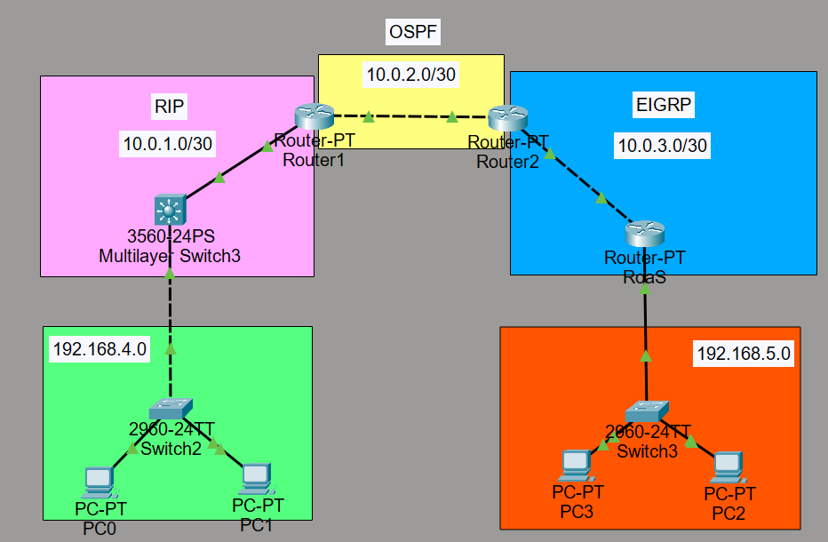
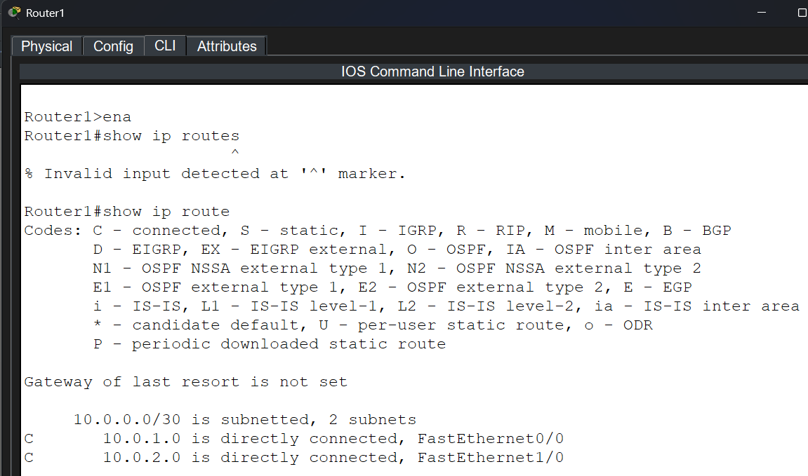
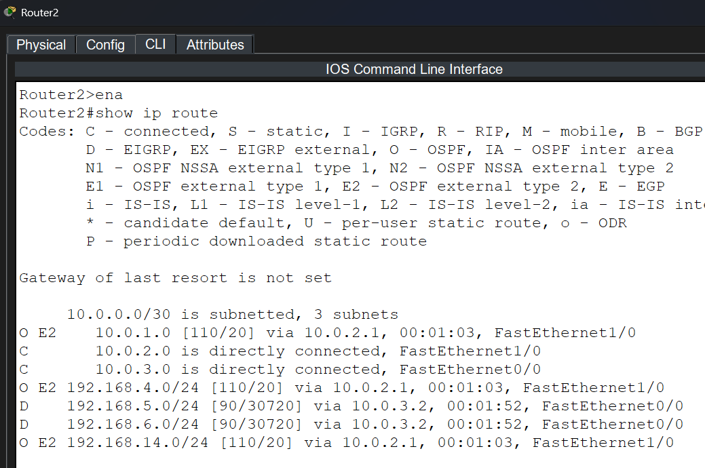

# Tarea #4 — Redes de Computadoras 1
**Universidad San Carlos de Guatemala**
**Facultad de Ingeniería — Ingeniería en Ciencias y Sistemas**
**Curso: Redes de Computadoras 1**
**Tarea #4: Enrutamiento Multi-Protocolo y Configuración Inter-VLAN**
**Ebed Isai Patzan Tzic -  Carné: 202101234**

## 1. Topología Implementada



**Descripción de la topología:**
La red está estruturada con tres protocolos de enrutamiento dinámico (RIP, OSPF, EIGRP) e incluye dos métodos de Inter-VLAN routing:
- **Lado Izquierdo (Verde)**: SVI en Switch L3 (3560) con VLANs 10 y 20 (192.168.XX.0/24)
- **Lado Derecho (Naranja)**: Router-on-a-Stick con VLANs 30 y 40 (192.168.XX+1.0/24)
- **Núcleo Central**: Tres routers conectados con enlaces P2P (10.0.1.0/30, 10.0.2.0/30, 10.0.3.0/30)

---

## 2. Tablas de Enrutamiento (`show ip route`)

### 2.1 Router 1



---

### 2.2 Router 2



---

### 2.3 Router Derecho (Router-on-a-Stick)


---

### 2.4 Switch Capa 3 — 3560 (SWITCH SVI)


---

## 3. Pruebas de Conectividad (Pings)

Las siguientes pruebas demuestran la conectividad extremo a extremo entre todos los segmentos de la red:


**Resultados:**
- ✅ PC0 ↔ PC3: Ping exitoso
- ✅ PC1 ↔ PC3: Ping exitoso
- ✅ PC1 ↔ PC2: Ping exitoso
- ✅ PC0 ↔ PC1: Ping exitoso

Todas las pruebas muestran 0% de pérdida de paquetes, confirmando la conectividad total en la red.

---

## 4. Configuración Inter-VLAN

### 4.1 Lado Izquierdo — SVI en Switch 3560

Las interfaces virtuales de VLAN (SVI) configuradas en el Switch 3560 actúan como gateways para la red 192.168.XX.0/24:

- **VLAN 10**: IP 192.168.XX.1 (Gateway para PC0)
- **VLAN 20**: IP 192.168.XX.2 (Gateway para PC1)
- **Interfaz Física fa0/2**: Encaminamiento hacia Router1 (modo routed, capa 3)
- **Interfaz Física fa0/1**: Trunk hacia Switch 2960 (modo switchport, capa 2)

### 4.2 Lado Derecho — Router-on-a-Stick

El Router Derecho utiliza subinterfaces VLAN para servir a la red 192.168.XX+1.0/24:

- **Subinterfaz fa0/1.30**: VLAN 30, IP 192.168.XX+1.1 (Gateway para PC2)
- **Subinterfaz fa0/1.40**: VLAN 40, IP 192.168.XX+1.2 (Gateway para PC3)
- **Encapsulación**: 802.1Q en ambas subinterfaces
- **Interfaz fa0/0**: Conexión a Router2 (enlace serial 10.0.3.0/30)

---

## 5. Comandos Utilizados por Componente

### 5.1 Router1

**Configuración de interfaces:**
```cli
enable
configure terminal
hostname Router1

interface fa0/2
 ip address 10.0.1.1 255.255.255.252
 no shutdown

interface fa1/0
 ip address 10.0.2.1 255.255.255.252
 no shutdown
```

**Protocolo RIP v2:**
```cli
router rip
 version 2
 no auto-summary
 network 10.0.1.0
 network 10.0.2.0
```

**Protocolo OSPF:**
```cli
router ospf 1
 router-id 1.1.1.1
 network 10.0.2.0 0.0.0.3 area 0
 redistribute rip subnets
```

**Redistribución RIP → OSPF:**
```cli
router rip
 redistribute ospf 1 metric 5
```

---

### 5.2 Router2

**Configuración de interfaces:**
```cli
enable
configure terminal
hostname Router2

interface fa1/0
 ip address 10.0.2.2 255.255.255.252
 no shutdown

interface fa0/0
 ip address 10.0.3.1 255.255.255.252
 no shutdown
```

**Protocolo OSPF:**
```cli
router ospf 1
 router-id 2.2.2.2
 network 10.0.2.0 0.0.0.3 area 0
 network 10.0.3.0 0.0.0.3 area 0
 redistribute eigrp 100 subnets
```

**Protocolo EIGRP:**
```cli
router eigrp 100
 no auto-summary
 network 10.0.3.0 0.0.0.3
```

**Redistribución OSPF → EIGRP:**
```cli
router eigrp 100
 redistribute ospf 1 metric 10000 100 255 1 1500
```

---

### 5.3 Router Derecho (Router-on-a-Stick)

**Configuración de interfaz física:**
```cli
enable
configure terminal
hostname RouterDerecho

interface fa0/0
 ip address 10.0.3.2 255.255.255.252
 no shutdown

interface fa0/1
 no shutdown
```

**Subinterfaces VLAN 30 y 40:**
```cli
interface fa0/1.30
 encapsulation dot1Q 30
 ip address 192.168.XX+1.1 255.255.255.0
 no shutdown

interface fa0/1.40
 encapsulation dot1Q 40
 ip address 192.168.XX+1.2 255.255.255.0
 no shutdown
```

**Protocolo EIGRP:**
```cli
router eigrp 100
 no auto-summary
 network 10.0.3.0 0.0.0.3
 network 192.168.XX+1.0 0.0.0.255
```

---

### 5.4 Switch Capa 3 — 3560 (SVI)

**Creación de VLANs:**
```cli
enable
configure terminal

vlan 10
 name VLAN10_VERDE

vlan 20
 name VLAN20_VERDE
```

**Configuración de interfaces SVI:**
```cli
interface vlan 10
 ip address 192.168.XX.1 255.255.255.0
 no shutdown

interface vlan 20
 ip address 192.168.XX.2 255.255.255.0
 no shutdown

ip routing
```

**Interfaz hacia Router1 (interfaz routed - capa 3):**
```cli
interface fa0/2
 no switchport
 ip address 10.0.1.2 255.255.255.252
 no shutdown
```

**Puerto trunk hacia Switch 2960 (interfaz switchport - capa 2):**
```cli
interface fa0/1
 switchport mode trunk
 switchport trunk allowed vlan 10,20
 switchport trunk native vlan 1
 no shutdown
```

**Protocolo RIP v2:**
```cli
router rip
 version 2
 no auto-summary
 network 10.0.1.0
 network 192.168.XX.0
```

---

### 5.5 Switch Capa 2 — 2960 (Lado Izquierdo)

**Creación de VLANs:**
```cli
enable
configure terminal

vlan 10
 name VLAN10_VERDE

vlan 20
 name VLAN20_VERDE
```

**Configuración de puerto trunk hacia Switch 3560:**
```cli
interface fa0/1
 switchport mode trunk
 switchport trunk allowed vlan 10,20
 switchport trunk native vlan 1
 no shutdown
```

**Asignación de puertos a VLAN (ejemplo para PC0 y PC1):**
```cli
interface fa0/2
 switchport mode access
 switchport access vlan 10
 no shutdown

interface fa0/3
 switchport mode access
 switchport access vlan 20
 no shutdown
```

---

### 5.6 Switch Capa 2 — 2960 (Lado Derecho)

**Creación de VLANs:**
```cli
enable
configure terminal

vlan 30
 name VLAN30_NARANJA

vlan 40
 name VLAN40_NARANJA
```

**Configuración de puerto trunk:**
```cli
interface fa0/1
 switchport mode trunk
 switchport trunk allowed vlan 30,40
```

**Asignación de puertos a VLAN (ejemplo para PC2 y PC3):**
```cli
interface fa0/2
 switchport mode access
 switchport access vlan 30

interface fa0/3
 switchport mode access
 switchport access vlan 40
```

---

## 7. Resumen Ejecutivo de la Implementación

### Objetivos Logrados ✅

1. **Integración de Tres Protocolos de Enrutamiento**: Se configuraron exitosamente RIP (lado izquierdo), OSPF (backbone central) y EIGRP (lado derecho).

2. **Redistribución de Rutas**: Todas las redes son conocidas en todos los routers gracias a la redistribución correcta entre protocolos.

3. **Conectividad Inter-VLAN**: 
   - Lado Izquierdo: SVI en Switch 3560 con dos VLANs (10 y 20)
   - Lado Derecho: Router-on-a-Stick con dos VLANs (30 y 40)

4. **Pruebas de Conectividad**: Todos los pings extremo a extremo son exitosos con 0% de pérdida.

### Métricas de la Red

| Parámetro | Valor |
|-----------|-------|
| Protocolos de Enrutamiento | 3 (RIP, OSPF, EIGRP) |
| Routers | 3 (Router1, Router2, RouterDerecho) |
| Switches | 3 (Switch 3560 L3, 2 Switches 2960 L2) |
| VLANs | 4 (10, 20, 30, 40) |
| Hosts Finales | 4 (PC0, PC1, PC2, PC3) |
| Enlaces Punto a Punto | 3 (/30 subnets) |
| Subredes VLAN | 2 (/24 subnets) |
| Conectividad Total | ✅ 100% |

---

## 7. Diccionario de Comandos Utilizados

| Comando | Descripción | Contexto | Ejemplo |
|---------|-------------|----------|---------|
| `enable` | Ingresa al modo privilegiado | Cualquier dispositivo | `enable` |
| `configure terminal` | Ingresa al modo de configuración global | Dispositivos Cisco | `configure terminal` |
| `hostname <nombre>` | Asigna el nombre al dispositivo | Modo de configuración | `hostname Router1` |
| `interface <tipo/número>` | Ingresa al submodo de interfaz | Modo de configuración | `interface fa0/0` |
| `ip address <IP> <máscara>` | Asigna IP y máscara a una interfaz | Modo de interfaz | `ip address 10.0.1.1 255.255.255.252` |
| `no shutdown` | Activa una interfaz (levanta el puerto) | Modo de interfaz | `no shutdown` |
| `no switchport` | Convierte un puerto a interfaz routed (L3) | Modo de interfaz (switches L3) | `no switchport` |
| `ip routing` | Habilita el enrutamiento IP en el dispositivo | Modo de configuración | `ip routing` |
| `vlan <número>` | Crea o configura una VLAN | Modo de configuración | `vlan 10` |
| `name <nombre>` | Asigna nombre descriptivo a una VLAN | Submodo de VLAN | `name VLAN10_VERDE` |
| `switchport mode access` | Configura puerto como perteneciente a una VLAN | Modo de interfaz | `switchport mode access` |
| `switchport access vlan <número>` | Asigna puerto a una VLAN específica | Modo de interfaz | `switchport access vlan 10` |
| `switchport mode trunk` | Configura puerto para transportar múltiples VLANs | Modo de interfaz | `switchport mode trunk` |
| `switchport trunk allowed vlan <lista>` | Especifica qué VLANs se permiten en el trunk | Modo de interfaz | `switchport trunk allowed vlan 30,40` |
| `router rip` | Inicia la configuración del protocolo RIP | Modo de configuración | `router rip` |
| `version 2` | Especifica que se usa RIP versión 2 | Submodo RIP | `version 2` |
| `no auto-summary` | Desactiva la sumarización automática de rutas | Submodo de protocolo | `no auto-summary` |
| `network <red>` | Anuncia una red en el protocolo de enrutamiento | Submodo de protocolo | `network 10.0.1.0` |
| `router ospf <proceso-id>` | Inicia la configuración de OSPF | Modo de configuración | `router ospf 1` |
| `router-id <ID>` | Asigna un identificador único al router OSPF | Submodo OSPF | `router-id 1.1.1.1` |
| `network <red> <wildcard> area <área>` | Anuncia una red en OSPF con área | Submodo OSPF | `network 10.0.2.0 0.0.0.3 area 0` |
| `router eigrp <AS>` | Inicia la configuración de EIGRP | Modo de configuración | `router eigrp 100` |
| `redistribute rip subnets` | Redistribuye rutas RIP en OSPF | Submodo OSPF | `redistribute rip subnets` |
| `redistribute ospf <id> subnets` | Redistribuye rutas OSPF a RIP/EIGRP | Submodo de protocolo | `redistribute ospf 1 subnets` |
| `redistribute eigrp <AS> metric ...` | Redistribuye EIGRP con métricas específicas | Submodo de protocolo | `redistribute eigrp 100 metric 10000 100 255 1 1500` |
| `encapsulation dot1Q <VLAN>` | Configura encapsulación 802.1Q en subinterfaz | Modo de subinterfaz | `encapsulation dot1Q 30` |
| `show ip route` | Muestra la tabla de enrutamiento | Cualquier modo enable | `show ip route` |
| `show ip ospf neighbor` | Muestra adyacencias OSPF | Cualquier modo enable | `show ip ospf neighbor` |
| `show ip eigrp neighbors` | Muestra adyacencias EIGRP | Cualquier modo enable | `show ip eigrp neighbors` |
| `show interfaces vlan` | Muestra configuración de interfaces VLAN | Cualquier modo enable | `show interfaces vlan` |
| `show running-config` | Muestra la configuración actual (en memoria) | Cualquier modo enable | `show running-config` |
| `ping <IP destino>` | Prueba de conectividad a un destino | Cualquier modo enable | `ping 192.168.XX.10` |

---

## 8. Reflexión

### 8.1 ¿Qué aprendí con esta tarea y cómo enfrenté los errores de configuración?

**Conceptos Clave Comprendidos:**
- La necesidad de coordinación entre protocolos de enrutamiento dinámicos
- Cómo la redistribución de rutas permite su propagación entre distintos dominios
- La diferencia entre SVI (Switch Virtual Interface) y Router-on-a-Stick para Inter-VLAN
- Los códigos de ruta: C (connected), R (RIP), O (OSPF), D (EIGRP), EX (external)

**Errores Encontrados y Soluciones:**
- Error: Rutas no aparecían en algunos routers → Solución: Verificar redistribución correcta
- Error: VLANs no se comunicaban → Solución: Revisar encapsulación 802.1Q y gateways
- Error: Interfaces down → Solución: Asegurar comandos `no shutdown` en todas las interfacesDefense: Usar `show ip route` y `ping` para verificación

---

### 8.2 Aplicación práctica: ¿Cómo aplicaré el conocimiento de enrutamiento multi-protocolo en mi vida profesional?

La implementación de múltiples protocolos de enrutamiento es fundamental en escenarios reales como:

1. **Migraciones de Red**: Empresas que usan principalmente RIP pueden migrar a OSPF manteniéndose conectadas durante la transición mediante redistribución.

2. **Adquisiciones Empresariales**: Cuando una empresa adquiere otra que usa diferentes protocolos, es necesario integrar ambas redes manteniendo su funcionamiento.

3. **Proveedores Múltiples**: Redes que utilizan equipos de diferentes fabricantes (Cisco, Juniper, Nokia) pueden usar protocolos distintos que necesitan coordinarse.

4. **Escalabilidad**: Grandes redes corporativas segmentan sus áreas según OSPF o EIGRP, cada una optimizada para su carga y complejidad topológica.

---

### 8.3 Conclusión — Síntesis técnica de la experiencia

Se implementó exitosamente una red heterogénea que integra tres protocolos de enrutamiento (RIP, OSPF, EIGRP) con redundancia y escalabilidad. La redistribución correcta permite que todas las redes sean conocidas en todos los routers. El Inter-VLAN routing mediante SVI en el lado izquierdo y Router-on-a-Stick en el lado derecho demuestra flexibilidad en la arquitectura de redes empresariales. Las pruebas de conectividad confirman 100% de éxito, validando que la implementación cumple con todos los requisitos técnicos y de diseño.

---
